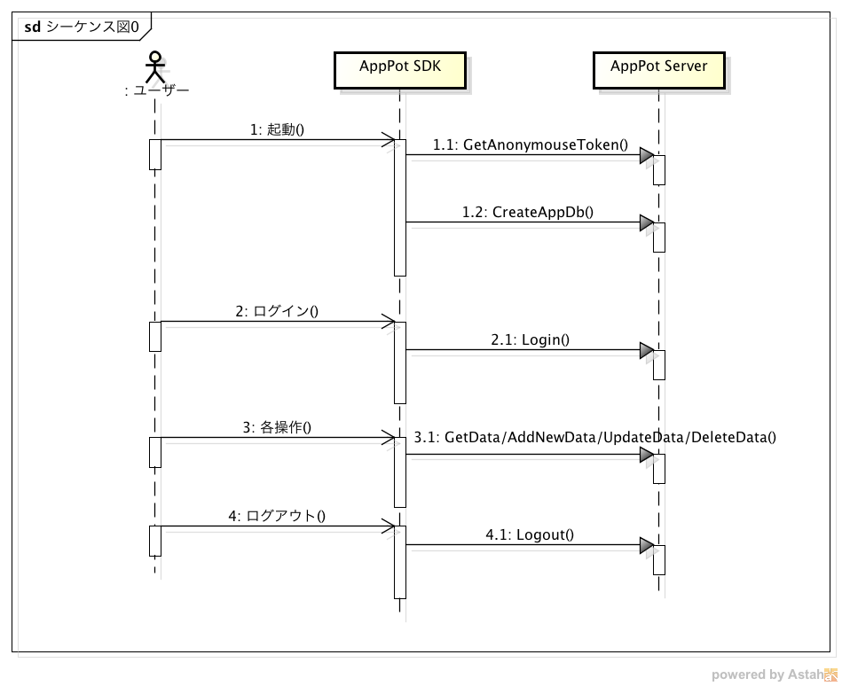

## AppPot REST API規約
1. プロトコルはHTTP/HTTPSとする
2. GETリクエストの場合はクエリ文字列を受け入れるものとする
3. POSTリクエストの場合はURLエンコーディングを行うものとする
4. POSTリクエストは基本的にJSON形式とする(Content-Type: application/json)
5. レスポンスはバイナリデータ以外場合はJSON形式とする
6. 全てのレスポンスオブジェクトにはAPI実行結果のステータスを表す **status** プロパティと、ステータスの詳細情報を表す **description** プロパティを持つものとする


## 公開API一覧
カテゴリ    | API                                       | リクエスト                          | レスポンス                 | 説明
---------- | ----------------------------------------- | --------------------------------- | ------------------------- | ---
ユーザ管理  | [Login](#login)                           | ユーザID、パスワード                 | ユーザ情報                 | 登録されたアカウント情報をもとに認証処理を実行します。
           | [Logout](#logout)                         | ユーザトークン                      | -                         | 指定されたユーザのセッションを破棄し、システムからログアウトします。
           | [DeviceRegistration](#deviceregistration) | デバイス情報                        | -                         | 端末情報をデバイス管理用のマスタに登録します。 
           | [GetAnonymousToken](#getanonymoustoken)   | アプリケーションキー、デバイスID      | 匿名トークン                | ログインの必要がないAPIのために使われる匿名トークンを返します。
           | [GetUserList](#getuserlist)               | ユーザトークン、グループID           | ユーザ情報リスト             | 指定したグループIDに関連所属するユーザの一覧を返します。
           | [GetGroupList](#getgrouplist)             | ユーザトークン                      | グループ情報リスト           | 現在のアプリケーションに関連付けられたグループの一覧を返します。  
データ管理  | [CreateAppData](#createappdata)           | テーブルスキーマ情報のリスト           | -                         | アプリケーションでスキーマ定義したテーブルをサーバーサイドに作成します。
           | [AddNewData](#addnewdata)                 | レコードオブジェクト                 | 登録レコードのサロゲートキー  | アプリケーションデータに新規レコードを挿入します。  複数レコードを一括で挿入することも可能です。
           | [UpdateData](#updatedata)                 | レコードオブジェクト                 | 更新レコードのサロゲートキー  | アプリケーションデータのレコードを更新します。複数レコードを一括で更新することも可能です。 
           | [DeleteData](#deletedata)                 | サロゲートキー                       | 削除レコードのサロゲートキー | アプリケーションデータの削除を行います。 複数レコードを一括で削除することも可能です。
           | [CheckAppData](#checkappdata)             | アプリケーションID                   | 存在したらYES、しなければNO  | 指定したアプリケーションIDとアプリケーションバージョンのデータベースがサーバーサイドに存在するかどうかをチェックします。
ログ管理    | [Log](#log)                               | メッセージ                          | -                         | 指定されたメッセージをサーバサイドのログに出力します。
           | [GetLogLevel](#getloglevel)               | -                                  | ログレベル                 | 現在のログレベルを取得します。
外部連携    | [Gateway](#gateway)                       | 実行サービス名、実行サービスのパラメータ | サービスの実行結果          | 任意の外部サービスを呼び出します。


## 処理シーケンス概要

ここでは全体の処理の流れを説明します。


1. GetAnonymouseToken
アプリキーを使って、匿名ユーザとして認証を行います。

3. CreateAppDb
定義したValue Objectを元にサーバー側にデータベースを作成します。

2. Login
ユーザーのID、パスワードを

4. GetData/UpdateData/AddNewData/Delete


***

## API説明
### ユーザ管理
* **ユーザデータの管理体系**  
:exclamation: AppPotではユーザはどのように管理されているのかを説明

* **ユーザ属性**  
:exclamation: 取り扱えるユーザの属性

* **認証の仕組み**  
:exclamation: 認証はどのように行われ、どこに認証状態が保持されるのかなどの説明

* **ユーザトークン**  
:exclamation: ユーザトークンの取り扱いについての説明

* **匿名トークン**  
:exclamation: 匿名トークンの扱いについて説明

***

#### Login
AppPotにて管理されているユーザ情報を元に認証処理を行います。  
認証に成功すればユーザ情報とユーザトークンを返します。  
失敗した場合はエラーステータスをもって通知します。

##### 処理シーケンス
1. 必須パラメータが指定されていない、または存在しない時、エラーを返します。
2. アカウントをチェックし、存在しない場合はエラーを返します。
3. もし加入者が存在するならば、トークンを生成します。
4. オブジェクト情報を返します。

##### URL
```
[POST] /{コンテキストルート}/api/Login
```

##### リクエストパラメータ
パラメータ名 | 説明
----------- | ----
username    | ユーザ名
password    | パスワード
appId       | アプリケーションID
appVersion  | アプリケーションのバージョン
deviceUDID  | デバイスID
authToken   | ユーザトークン
isPush      | プッシュ通知を利用するかどうかの真偽値

##### リクエストサンプル
```
{
  "username": "sogo@stew.com",
  "password": "123456",
  "appId": "sogo.app",
  "appVersion": "1.0",
  "authToken":"d46626e05c4e4fa38cc8bbd30ba98cbd",  
  "deviceUDID": "E9J5J94J-2C5B-4F97-BC61-90284830E1DA",
  "isPush": "false"
}
```

##### レスポンスプロパティ
プロパティ名              | 説明
----------------------- | ----
       authInfo         | 認証したユーザ情報
&nbsp;  ∟userTokens     | ユーザトークン
&nbsp;  ∟validTime      | 有効期間（ms）
&nbsp;  ∟userId         | ユーザID
&nbsp;  ∟userInfo       | ユーザ情報
&nbsp;  ∟groupsAndRoles | グループと権限情報の組み合わせ

##### レスポンスサンプル
```
{
   "status": "OK",
   "description": null,
   "authInfor": {
      "userTokens": "8560ba5e81af4279a0c3bfd3d1f6827b",
      "validTime": 18000000,
      "userId": 20,
      "userInfo": {
            "account":"admin@stew.com",
            "fistName":"ryohei",
            "lastName":"sogo"
      },
      "groupsAndRoles": [
         {
            "groupId": 12,
            "groupName": "アーバーンクローゼット",
            "roleName": "User",
            "roleId": 4
         }
      ]
   }
}
```

***

#### Logout
指定されたユーザのセッションを破棄し、システムからログアウトします。 

##### 処理シーケンス
1. ユーザーセッションが存在しない、または既に破棄されている場合はエラーを返します。
2. 指定されたユーザトークンに該当するユーザセッションを破棄します。

##### URL
```
[POST] /{コンテキストルート}/api/Logout
```

##### リクエストパラメータ
パラメータ名 | 説明
----------- | ----
token       | ユーザトークン

##### リクエストサンプル
```
{
  "token":"a294e9de50e14cf0b3e04f19d3f4b790"
}
```

##### レスポンスプロパティ
プロパティ名 | 説明
---------- | ----
(なし)      | -

##### レスポンスサンプル
```
{
  "status”:"OK",
  "description":"",
}
```

***
#### DeviceRegistration
端末情報をデバイス管理用のマスタに登録します。  
端末情報はPush通知を行う際に使用されます。

##### 処理シーケンス
1. 同一の端末情報が既に登録されている場合はエラーを返します。
2. リクエストされた端末情報を登録します。

##### URL
```
[POST] /{コンテキストルート}/api/DeviceRegistration
```

##### リクエストパラメータ
パラメータ名 | 説明
----------- | ----
deviceToken | 開発者がアップルに登録したトークン
appId       | アプリケーションID   
deviceUDID  | デバイスID
appVersion  | アプリケーションバージョン
osType      | オペレーティングシステムタイプ(iOS/Android)
deviceName  | デバイス名

##### リクエストサンプル
```
{
  "deviceToken": "device token 1",
  "appId": "sogo.app",
  "osType": "iOS",
  "deviceName": "iPhone 4",
  "appVersion": "1.0",
  "deviceUDID": "E9J5J94J-2C5B-4F97-BC61-90284830E1DA",
  "authToken": "5231cf92e4b07a1a72f2d27c"
}
```

##### レスポンスプロパティ
プロパティ名 | 説明
----------- | ----
(なし)      | -

##### レスポンスサンプル
```
{
  "status": "error"
  "description": "The device already registered for this device and app"
}
```

***

#### GetAnonymousToken
ログインの必要がないAPIのために使われる匿名トークンを返します。

##### 処理シーケンス
1. 匿名トークンを生成して返します

##### URL
```
[POST] /{コンテキストルート}/api/GetAnonymousToken
```

##### リクエストパラメータ
パラメータ名 | 説明
---------- | ----
appKey     | アプリケーションキー
deviceUDID | デバイスID

##### リクエストサンプル
```
{
  "appKey": "9c1c1e3e7e4a402a8ab8896d6d9fc65a",
  "deviceUDID": "E9J5J94J-2C5B-4F97-BC61-90284830E1DA"
}
```

##### レスポンスプロパティ
プロパティ名 | 説明
----------- | ----
results　   | 匿名トークン

##### レスポンスサンプル
```
{
  status: "OK"
  description: null
  results: "e0aec9d8fc834456bc55dc18f2b99a64"
}
```

***

#### GetUserList
現在利用しているアプリケーションにおいて、指定したグループに所属するユーザ情報の一覧を取得します。   

##### 処理シーケンス
1. ユーザセッションと対象アプリケーションの妥当性を検証し、不正な場合はエラーを返します。
2. ユーザセッションに紐づくアプリケーションと、指定したグループ情報を条件にユーザ情報の一覧を取得し、返します。

##### URL
```
[POST] /{コンテキストルート}/api/GetUserList
```

##### リクエストパラメータ
パラメータ名 | 説明
---------- | ----
token      | ユーザトークン
groupId    | グループID

##### リクエストサンプル
```
{
  "token": "d8796581fac54b28a32b655e57d1c1e7",
  "groupId": 1
}
```

##### レスポンスプロパティ
プロパティ名          | 説明
------------------- | ----
        results　   | ユーザ情報リスト
&nbsp;   ∟userId    | ユーザID
&nbsp;   ∟firstName | ユーザ名
&nbsp;   ∟lastName  | ユーザ姓
&nbsp;   ∟role      | ユーザの権限

##### レスポンスサンプル
```
{
  "status":"OK", 
  "description":null,
  "results":[
    {
      "userId":"11",
      "firstName":"TEST",
      "lastName":"test",
      "role":"Manager"
    },   
    {
      "userId":"rsogo@gmail.com",
      "firstName":"S",
      "lastName":"R",
      "role":"User"
    },   
    {
      "userId":"trinhduc20@gmail.com",
      "firstName":"Tran",
      "lastName":"Trinh",
      "role":"Manager"
    }
  ]
}
```

***


#### GetGroupList
現在利用しているアプリケーションに関連付けられたグループ情報の一覧を取得します。   

##### 処理シーケンス
1. ユーザセッションと対象アプリケーションの妥当性を検証し、不正な場合はエラーを返します。
2. ユーザセッションに紐づくアプリケーションを条件に関連するグループ情報の一覧を取得し、返します。 

##### URL
```
[POST] /{コンテキストルート}/api/GetGroupList
```

##### リクエストパラメータ
パラメータ名 | 説明
---------- | ----
token      | ユーザトークン

##### リクエストサンプル
```
{
  "token": "d8796581fac54b28a32b655e57d1c1e7"
}
```

##### レスポンスプロパティ
プロパティ名           | 説明
--------------------- | ----
        results　     | グループ情報リスト
&nbsp;   ∟groupId     | グループID
&nbsp;   ∟groupName   | グループ名
&nbsp;   ∟description | グループの説明

##### レスポンスサンプル
```
{
  "status":"OK",
  "description":null,
  "results":[
    {
      "groupId":1,
      "groupName":"Group 1",
      "description":"This is group 1"
    }
  ]
}
```

***


### データ管理
サーバーサイドでアプリケーションデータを管理するストレージを用意します。  
ストレージにはRDBMSを利用します。  
利用者は、サーバーサイドのRDBを意識する事なく、クライアントサイドのストレージ操作だけでサーバーサイドのデータを管理できます。  

* **データ参照のスコープ**  
データ参照のスコープは登録したユーザーのみ、登録したユーザーに所属するグループ内で共有、全体で共有から選択できます。

* **サロゲートキーについて**  
AppPotはobjectIdという値が同一Value Object内で一意になるカラムを必ず持ちます。  
objectIdはAppPotサーバーで採番されます。  
新規追加時はAppPotサーバーで払い出されたobjectIdをクライアント側のDBに保存する処理が必要になりますが、SDKを利用する場合は、SDKが自動的に行います。

* **楽観的排他について**  
AppPotはサーバー側で更新された日時を管理しています。  
クライアントがAppPotサーバーからデータを取得した際に、サーバーで最後に更新された日時も取得し、更新する際にリクエストに取得したサーバー更新日時も一緒に送っています。  
サーバー側で別のトランザクションで同一のレコードが更新されている場合は、後から送信した処理が楽観的ロックによりエラーになります。  
SDKを使用している場合は、この処理はSDKにより自動化されます。  
APIを直接利用している場合は、サーバーから受け取ったサーバー更新日時を更新時のリクエストに含める処理を行う必要があります。

* **2重処理防止について**  
データの更新系のAPIには同一処理の2重処理（ボタンの2度押しなど）を防止する仕組みを提供しています。  
リクエストにトランザクションIDを割り振り、処理したトランザクションIDを履歴管理します。  
既に処理済みのトランザクションIDを持つリクエストが来た場合は、エラーとして返します。  
トランザクションIDはSDKが採番します。  

***

#### CreateAppData
アプリケーションでスキーマ定義したテーブルをサーバーサイドに作成します。  
アプリケーションはサーバーサイドで作業する事なく、クライアントSDK側でスキーマを定義しておくだけで、本API呼び出し時に自動的にテーブルが生成されます。 

##### 処理シーケンス
1. ユーザセッションと対象アプリケーションの妥当性を検証し、不正な場合はエラーを返します。
2. 指定されたアプリケーションテーブルのスキーマ定義が不正であればエラーを返します。
3. isResetDatabaseパラメータがtrueの場合は、常にテーブルを作成します。
4. isResetDatabaseパラメータがfalseの場合は、テーブルが存在していなければテーブルを作成します。

##### URL
```
[POST] /{コンテキストルート}/api/CreateAppData
```

##### リクエストパラメータ
パラメータ名              | 説明
----------------------- | ----
        isResetDatabase | true : 常にテーブルを作り直す / false : 存在しなければ作成する
        tables          | テーブルスキーマ情報のリスト（テーブル情報/各項目情報）
&nbsp;   ∟primary_key   | プライマリキーの項目名（"objectId"に固定）
&nbsp;   ∟name          | テーブル名
&nbsp;   ∟columns       | 項目情報の配列

##### リクエストサンプル
```
{
  "appId":"app.thai",
  "appVersion":"1.0",
  "authToken": "d46626e05c4e4fa38cc8bbd30ba98cbd",
  "isResetDatabase": true,
   "tables":[
      {
         "primary_key":"objectId",
         "name":"department",
         "columns":[
            {
               "colName":"UpdateTime",
               "type":"integer"
            },
            {
               "colName":"CreateTime",
               "type":"integer"
            },
            {
               "colName":"isHave",
               "type":"integer"
            },
            {
               "colName":"nameOfDepart",
               "type":"varchar"
            },
            {
               "colName":"objectId",
               "type":"varchar"
            },
            {
               "colName":"scopeType",
               "type":"varchar"
            }
         ]
      }
   ]
}
```

##### レスポンスプロパティ
プロパティ名 | 説明
----------- | ----
(なし) 　   | -

##### レスポンスサンプル
```
{
    "status": "OK",
    "description": null,
}
```

***
#### GetData
レコードのサロゲートキー指定でレコードを取得します。  
サロゲートキーを指定しなかった場合は、任意の検索条件を指定して複数件のデータを取得します。

##### 処理シーケンス
1. ユーザセッションと対象アプリケーションの妥当性を検証し、不正な場合はエラーを返します。
2. サロゲートキーが指定されている場合は、そのキーを元に検索条件式を生成します。
3. サロゲートキーが指定されていない場合は、リクエストされた検索条件で条件式を生成します。
4. ユーザーのアクセスできるスコープの条件を検索条件式に付加します。
5. 対象のテーブルを上記作成の検索条件で検索します。
6. 検索結果を返します。

##### URL
```
[POST] /{コンテキストルート}/api/GetData
```

##### リクエストパラメータ
パラメータ名                | 説明
------------------------- | ----
        objectName        | テーブル名
        recordId          | サロゲートキー
        maxRecord         | ページングする場合の1ページあたりの最大レコード件数
        pageIndex         | ページングする場合の取得するページインデックス
        condition         | 検索条件
&nbsp;   ∟sortConditions  | ソート条件を表すオブジェクト
&nbsp;   ∟joinConditions  | 結合条件を表すオブジェクト
&nbsp;   ∟whereConditions | Where条件を表すオブジェクト
&nbsp;   ∟scope           | データ取得スコープ(1: User, 2: Group, 3: All)

##### リクエストサンプル
```
{
  "maxRecord": 1000,
  "token": "b92a50c2f7cb499398c957da385bf10b",
  "pageIndex": 1,
  "objectName": "casereport",
  "condition": {
    "sortConditions": [
      {
        "conditionValue": 1, // 1: ASC, 2: DESC
        "columnName": "UpdateTime"
      }
    ],
    "whereConditions": [
      {
        "searchConditions": [
          {
            "type": 1, // 1: equal, 2: not equal, 3: like, 4: greater than, 
                       // 5: greater than or equal, 6: less than, 
                       // 7: less than or equal, 8: in
            "columnName": "age",
            "conditionValue": ["2"]
          }
        ],
        “type”: “AND” //”AND”: And query condition, “OR”: Or query condition
      },
      {
        "searchConditions": [
          {
            "type": 1,
            "columnName": "scopeType",
            "conditionValue": ["2"]
          }
        ],
        “type”: “OR”
      }
    ],
    "joinConditions": [
      {
        "joinType": 1, //1: Inner join
        "joinObjectName": "follow",
        "joinColumn": "caseReportID",
        "baseColumn": "objectId",
        "whereConditions": [
          {
            "searchConditions": [
              {
                "type": 1,
                "columnName": "scopeType",
                "conditionValue": ["2"]
              }             
            ],
            "type":"AND"
          },
          {
            "searchConditions": [
              {
                "type": 1,
                "columnName": "date",
                "conditionValue": ["1392476400"]
              },
              {
                "type": 1,
                "columnName": "maxBloodPressure",
                "conditionValue": ["222"]
              }                    
            ],
            "type": "OR"
          }                               
        ]
      }
    ],    
    "scope":1 // 1: User, 2: Group, 3: All
  }
}
```

##### レスポンスプロパティ
プロパティ名          | 説明
------------------- | ----
        results     | 検索結果のレコードリスト
&nbsp;   ∟record    | レコード情報
        counter     | 検索にヒット件数
        totalPage   | ページングした場合のトータルページ数
        pageIndex   | ページングした場合の取得したページインデックス

##### レスポンスサンプル
```
{
  "status":"OK",
  "results":[
    {
      "record":[
        {
            "name":"isUsingLockForUpdate",
            "value":"0.0"
        },
        {
            "name":"scopeType",
            "value":"1.0"
        },
        {
            "name":"createTime",
            "value":"1.39270006E9"
        },
        {
            "name":"updateTime",
            "value":"1.3927091E9"
        },
        {
            "name":"memo",
            "value":"ssss"
        },
        {
            "name":"isFollow",
            "value":"1.0"
        },
        {
            "name":"patientName",
            "value":""
        },
        {
            "name":"persistentType",
            "value":"0.0"
        },
        {
            "name":"scopeTypeForAutoRefresh",
            "value":"1.0"
        },
        {
            "name":"boolTest",
            "value":"0.0"
        },
        {
            "name":"lifeSpan",
            "value":"2.0"
        },
        {
            "name":"objectId",
            "value":"CaseReport_1392558948933"
        },
        {
            "name":"syncStatus",
            "value":"0"
        },
        {
            "name":"gender",
            "value":"0.0"
        },
        {
            "name":"isAutoRefresh",
            "value":"0.0"
        },
        {
            "name":"age",
            "value":"2.0"
        },
        {
            "name":"autoRefreshInterval",
            "value":"600.0"
        },
        {
            "name":"createUserId",
            "value":"3.0"
        },
        {
            "name":"groupIds",
            "value":null
        },
        {
            "name":"serverCreateTime",
            "value":"2014-02-16T22:55:48.932+09:00"
        },
        {
            "name":"serverUpdateTime",
            "value":"2014-02-19T21:11:21.852+09:00"
        }
      ]
    }
  ],
  "counter":1,
  "totalPage":1,
  "pageIndex":1,
  "description":null
}
```

***
#### AddNewData
アプリケーションデータに新規レコードを挿入します。   
複数レコードを一括で挿入することも可能です。

##### 処理シーケンス
1. ユーザセッションと対象アプリケーションの妥当性を検証し、不正な場合はエラーを返します。
2. 処理履歴から、既に処理済みのトランザクションIDかを検証し、処理済みであればエラーを返す。
3. 登録データに不正なデータ構成がないかを検証し、不正な場合はエラーを返します。
4. データを対象テーブルに登録します。
5. トランザクションIDを処理履歴に登録します。

##### URL
```
[POST] /{コンテキストルート}/api/AddNewData  
```

##### リクエストパラメータ
パラメータ名            | 説明
--------------------- | ----
        objectName    | テーブル名
        transactionId | トランザクションID
        data          | 登録するレコードオブジェクトのリスト
&nbsp;   ∟record      | レコード情報

##### リクエストサンプル
```
{
  "data": [
    {
      "record":[
        {
          "value":"sdiufhisdufhksdf",
          "name":"objectId"
        },
        {
          "value":"1390085336544",
          "name":"CreateTime"
        },
        {
          "value":"123546512.1245",
          "name":"UpdateTime"
        },
        {
          "value":"This is depart 1",
          "name":"nameOfDepart"
        },
        {
          "value":"1",
          "name":"isHave"
        },
        {
          "value":"2", //1: User, 2: Group, 3: All
          "name":"scopeType"
        },
        {
          "value":"1",
          "name":"groupIds"
        }
      ]
    },
    {
      "record":[
        {
          "value":null,
          "name":"objectId"
        },
        {
          "value":"1390085356736544",
          "name":"CreateTime"
        },
        {
          "value":"1235465167821245",
          "name":"UpdateTime"
        },
        {
          "value":null,
          "name":"nameOfDepart"
        },
        {
          "value":"2",
          "name":"isHave"
        },
        {
          "value":"2",
          "name":"scopeType"
        },
        {
          "value":"2",
          "name":"groupIds"
        }
      ]
    }
  ],
  "token":"36532aad619a4b95ad4dbd63454e5ff1",
  "transactionId": "deviceUDID_20142305104705.550",
  "objectName":"department"
}
```

##### レスポンスプロパティ
プロパティ名                 | 説明
-------------------------- | ----
        results            | 挿入したレコードのサロゲートキーと更新時間、またはそのリスト
&nbsp;   ∟objectId         | サロゲートキー
&nbsp;   ∟serverCreateTime | サーバーデータ生成時間
&nbsp;   ∟serverUpdateTime | サーバーデータ更新時間

##### レスポンスサンプル
```
{
    "status": "OK",
    "description": null,
    "results": [
        {
            "objectId": "department_1390463076564",
            "serverCreateTime": "2014-01-23T14:44:36.516+07:00",
            "serverUpdateTime": "2014-01-23T14:50:43.035+07:00"
        },
        {
            "objectId": "department_1390463076611",
            "serverCreateTime": "2014-01-23T14:44:36.567+07:00",
            "serverUpdateTime": "2014-01-23T14:50:43.067+07:00"
        }
    ]
}
```


***
#### UpdateData
アプリケーションデータのレコードを更新します。  
複数レコードを一括で更新することも可能です。

##### 処理シーケンス
1. ユーザセッションと対象アプリケーションの妥当性を検証し、不正な場合はエラーを返します。
2. 処理履歴から、既に処理済みのトランザクションIDかを検証し、処理済みであればエラーを返す。
3. 登録データに不正なデータ構成がないかを検証し、不正な場合はエラーを返します。
4. 楽観的排他チェックを実施、更新が競合していればエラーを返します。
5. 対象テーブルのデータを更新します。
6. トランザクションIDを処理履歴に登録します。

##### URL
```
[POST] /{コンテキストルート}/api/UpdateData
```

##### リクエストパラメータ
パラメータ名            | 説明
--------------------- | ----
        objectName    | テーブル名
        transactionId | トランザクションID
        data          | 更新するレコードオブジェクト、またはそのリスト
&nbsp;   ∟record      | レコード情報

##### リクエストサンプル
```
{
  "data": [
    {
      "record":[
        {
          "value":"department_1390463076564",
          "name":"objectId"
        },
        {
          "value":"1390085336544",
          "name":"CreateTime"
        },
        {
          "value":"1235465121245",
          "name":"UpdateTime"
        },
        {
          "value":"Edited object 44",
          "name":"nameOfDepart"
        },
        {
          "value":"1",
          "name":"isHave"
        },
        {
          "value":"2014-01-23T14:44:36.516+07:00",
          "name":"serverUpdateTime"
        }
      ]
    },
    {
      "record":[
        {
          "value":"department_1390463076611",
          "name":"objectId"
        },
        {
          "value":"1390085356736544",
          "name":"CreateTime"
        },
        {
          "value":"1235465167821245",
          "name":"UpdateTime"
        },
        {
          "value":"Edited object",
          "name":"nameOfDepart"
        },
        {
          "value":"2",
          "name":"isHave"
        },
        {
          "value":"2014-01-23T14:44:36.567+07:00",
          "name":"serverUpdateTime"
        }
      ]
    }
  ],
  "token":"66fecf82dfbf4042a331e43da79bcfbb",
  "transactionId": "deviceUDID_20142305104705.550",
  "objectName":"department"
}
```

##### レスポンスプロパティ
プロパティ名                 | 説明
-------------------------- | ----
        results            | 更新したレコードのサロゲートキーと更新時間、またはそのリスト
&nbsp;   ∟objectId         | サロゲートキー
&nbsp;   ∟serverCreateTime | サーバーデータ生成時間
&nbsp;   ∟serverUpdateTime | サーバーデータ更新時間

##### レスポンスサンプル
```
{
    "status": "OK",
    "description": null,
    "results": [
        {
            "objectId": "department_1390463076564",
            "serverCreateTime": "2014-01-23T14:44:36.516+07:00",
            "serverUpdateTime": "2014-01-23T14:50:43.035+07:00"
        },
        {
            "objectId": "department_1390463076611",
            "serverCreateTime": "2014-01-23T14:44:36.567+07:00",
            "serverUpdateTime": "2014-01-23T14:50:43.067+07:00"
        }
    ]
}
```


***
#### DeleteData
サロゲートキーによるアプリケーションデータの削除を行います。 
複数レコードを一括で削除することも可能です。

##### 処理シーケンス
1. ユーザセッションと対象アプリケーションの妥当性を検証し、不正な場合はエラーを返します。
2. 処理履歴から、既に処理済みのトランザクションIDかを検証し、処理済みであればエラーを返す。
3. 楽観的排他チェックを実施、更新が競合していればエラーを返します。
4. 対象テーブルのデータを削除します。
5. トランザクションIDを処理履歴に登録します。

##### URL
```
[POST] /{コンテキストルート}/api/DeleteData
```

##### リクエストパラメータ
パラメータ名                 | 説明
-------------------------- | ----
        objectName         | テーブル名
        transactionId      | トランザクションID
        objectIds          | 削除対象レコードのサロゲートキー、またはそのリスト
&nbsp;   ∟objectId         | サロゲートキー
&nbsp;   ∟serverUpdateTime | サーバー更新時間(楽観的排他チェック用)

##### リクエストサンプル
```
{
  "token":"f0aef39a0f4a4e5f8b0be9763633a14f",
  "transactionId": "deviceUDID_20142305104705.550",
  "objectIds":[
    {
      "objectId": "department_1390444506968",
      "serverUpdateTime": "2014-01-23T14:33:26.152+07:00"
    },
    {
      "objectId": "department_1390444507770",
      "serverUpdateTime": "2014-01-23T14:33:26.222+07:00"
    }
  ],
  "objectName":"department"
}
```
##### レスポンスプロパティ
プロパティ名                 | 説明
-------------------------- | ----
        results            | 削除したレコードのサロゲートキーと更新時間、またはそのリスト
&nbsp;   ∟objectId         | サロゲートキー
&nbsp;   ∟serverCreateTime | サーバーデータ生成時間
&nbsp;   ∟serverUpdateTime | サーバーデータ更新時間

##### レスポンスサンプル
```
{
    "status": "OK",
    "description": null,
    "results": [
        {
            "objectId": "department_1390444506118",
            "serverCreateTime": "2014-01-23T09:35:06.044+07:00",
            "serverUpdateTime": "2014-01-23T09:35:06.044+07:00"
        },
        {
            "objectId": "department_1390444507490",
            "serverCreateTime": "2014-01-23T09:35:07.489+07:00",
            "serverUpdateTime": "2014-01-23T09:35:07.489+07:00"
        }
    ]
}
```


***
#### CheckAppData
指定したアプリケーションIDとアプリケーションバージョンのデータベースがサーバーサイドに存在するかどうかをチェックします。  
存在した場合、サーバーはYESを返します。  
まだ作られていなかった場合はNOを返します。  

##### 処理シーケンス
1. 対象のアプリケーションのデータベースの存在を確認
2. 存在していればYESを、存在していなければNOを返す 

##### URL
```
[POST] /{コンテキストルート}/api/CheckExistenceOfAppDatabase
```

##### リクエストパラメータ
パラメータ名 | 説明
----------- | ----
appId       | アプリケーションID  
appVersion  | アプリケーションバージョン

##### リクエストサンプル
```
{
    "appId": "app.trinh",
    "appVersion": "1.0"
}
```

##### レスポンスプロパティ
プロパティ名 | 説明
---------- | ----
status     | 存在していればYES、存在していなければNO

##### レスポンスサンプル
```
{
    "status": "YES",
    "description": "",
    "results": null
}
```

***


### ログ管理
* **ログの出力先と確認方法**  
:exclamation: ログの出力先と確認方法について説明

* **ログレベル**  
:exclamation: ログレベルの説明。

* **ログタイプ**  
:exclamation: ログタイプの説明。

***

#### Log
指定されたメッセージをサーバサイドのログに出力します。

##### 処理シーケンス
1. ユーザセッションと対象アプリケーションの妥当性を検証し、不正な場合エラーを返します。  
2. ログを出力します。

##### URL
```
[POST] /{コンテキストルート}/api/Log
```

##### リクエストパラメータ
パラメータ名 | 説明
----------- | ----
type        | ログタイプ(error:1、event:2)        
message     | メッセージ

##### リクエストサンプル
```
{
  "message": "this is first message",
  "token": "789w34uhjsd78236jhg",
  "appId": "appid",
  "appVersion": "1.0",
  "deviceUDID": "E9J5J94J-2C5B-4F97-BC61-90284830E1DA",
  "type": "ERROR"
}
```

##### レスポンスプロパティ
プロパティ名 | 説明
----------- | ----
(なし)      | -

##### レスポンスサンプル
```
{
  “status”:”OK”
}
```

***

#### GetLogLevel
現在アプリケーションに設定されているログレベルを取得します。

##### 処理シーケンス
1. ログレベルを取得し返します。

##### URL
```
[GET] /{コンテキストルート}/api/GetLogLevel/{token}
```

##### リクエストパラメータ
パラメータ名 | 説明
---------- | ----
token      | ユーザトークン

##### レスポンスプロパティ
プロパティ名 | 説明
----------- | ----
result      | ログレベル

##### レスポンスサンプル
```
{
  “status”:”OK”,
  “result”:”ERROR”
  “description”:””
}
```

***


### 外部連携
* **外部Webサービス呼び出しのアーキテクチャ**  
:exclamation: 外部Webサービス呼び出しのアーキテクチャについて記述する    

* **ESB Muleとの連携**  
:exclamation: ESB Muleとの連携する場合の仕組みについて記述する  

***

#### Gateway
指定したサービス名の外部サービス(Webサービス)を呼び出します。  
呼び出すサービスはゲートウェイ定義ファイルに事前に登録してサーバーのクラスパス上に配置しておく必要があります。  

##### 処理シーケンス
1. ユーザセッションと対象アプリケーションの妥当性を検証し、不正な場合エラーを返します。  
2. ゲートウェイ定義ファイルより指定されたサービス名の情報を取得します。  
3. 取得したサービス情報を元に、クライアントにて指定したリクエストパラメータ、ならびにリクエストボディを流用して、外部サービスを呼び出します。  
4. 外部サービスの実行結果であるレスポンスをそのままクライアントに戻します。   

##### URL
```
[GET] /{コンテキストルート}/api/GateWay{token}&{servicename}&{任意のパラメータ}
```
```
[POST] /{コンテキストルート}/api/GateWay{token}&{servicename}
```

##### ゲートウェイ定義ファイル項目
gatewayConfig.xml  

項目名       | 説明
----------- | ----
appId       | アプリケーションID
appVersion  | アプリケーションバージョン  
servicename | サービス名(任意)
protocol    | プロトコル
targetHost  | ホスト名
targetPort  | ポート番号
targetUrl   | URL

##### ゲートウェイ定義ファイルサンプル  
```
<?xml version="1.0" encoding="UTF-8"?>
<gatewayInfo>
    <appId value="app.th">
        <appVersion value="1.0">
            <serviceName value="YY">
                <protocol>http</protocol>
                <targetHost>49.212.158.239</targetHost>
                <targetPort>8080</targetPort>
                <targetUrl>/StewSprint8/api/GetAnonymousToken</targetUrl>
            </serviceName>
            <serviceName value="service2">
                <protocol>http</protocol>
                <targetHost>123.30.92.18</targetHost>
                <targetPort>8080</targetPort>
                <targetUrl>/StewSprint8/api/GetAnonymousToken</targetUrl>
            </serviceName>
        </appVersion>
    </appId>
</gatewayInfo>
```


##### リクエストパラメータ
パラメータ名         | 説明
------------------ | ----
token              | ユーザトークン       
servicename        | サービス名
(実行サービスに依存) | -

##### レスポンスプロパティ
プロパティ名        | 説明
----------------- | ----
(実行サービスに依存) | -

***


## エラーコード一覧
コード | メッセージ                                                    | 発生元
----- | ------------------------------------------------------------ | -----
101   | The App with id given does not exist.                        | 全般
102   | App database not defined.                                    | AddNewData/UpdateData/DeleteData/GetData
103   | Cannot create app database                                   | CreateaAppData
104   | Not match between appId, appVersion and authentication token | 全般
105   | App does not exist.                                          | Gateway
106   | The App id or app version is not correct.                    | 全般
107   | The app not assign for groups user belong to.                | 全般
108   | AppID and UserID do not match                                | 全般
109   | Input data is not valid.                                     | AddNewData
110   | User does not exist                                          | Authentication
111   | User name or password is not correct                         | Authentication
112   | Not match between user infomation and authentication token   | 全般
120   | The token is expired.                                        | 全般
121   | Token does not exist.                                        | 全般
130   | Record does not exist or data blocking                       | UpdateData/DeleteData
131   | Process error.                                               | 全般
160   | Not match between deviceUDID and authentication token        | 全般
161   | The device already registered for this device and app.       | DeviceRegistration
162   | The device token already registered by another device.       | (使われていない)
163   | Please register you device before login.                     | Authentication
198   | Input parameters are required                                | Authentication
199   | Request not found.                                           | 全般
201   | Problem occurs during saving user session.                   | Login/GetAnonymousToken
202   | Cannot connect to app database                               | DeleteData
205   | Problem occurs during deletion user session.                 | DeleteData
206   | Problem occurs during saving device register.                | DeviceRegistration
210   | Problem occurred when saving transaction                     | AddNewData/UpdateData/DeleteData
211   | Transaction Id existed                                       | AddNewData/UpdateData/DeleteData
212   | Problem occurred when getting record                         | AddNewData/UpdateData/DeleteData/GetData
220   | Cannot excute query                                          | DeleteData
990   | This table does not change.                                  | GetDataForTable/GetAllDataForTable
991   | Cannot get table tracking change of records.                 | (使われていない)
992   | Data does not exist with that token.                         | getTableNameForSync
993   | Requested table is empty or does not exist.                  | AddNewData/UpdateData/DeleteData/GetData
994   | Cannot post data                                             | 全般
995   | Table does not exist                                         | AddNewData/UpdateData/DeleteData/GetData