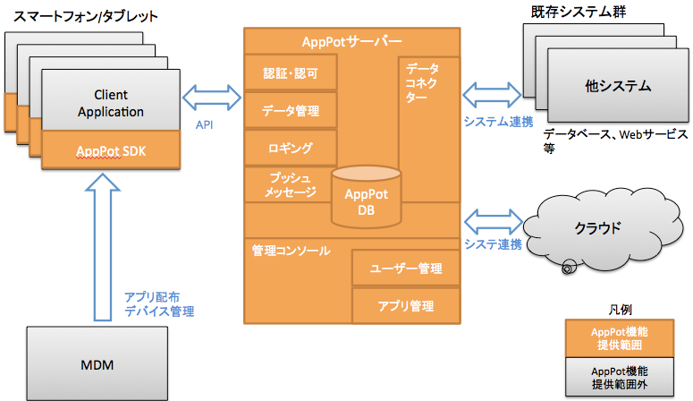
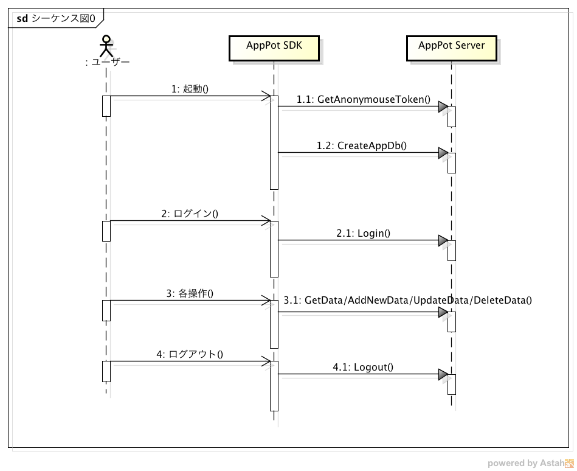

# API説明ドキュメント

## 全体の構造

基本的にはPPTに資料あり。→十川

### 全体構成図

AppPotはAppPotサーバーと、AppPot SDKから構成されています。
複数のアプリを共通のプラットフォームで管理するコンセプトとなっているため、複数のアプリを運用したとしてもAppPotは同じものを利用できます。

### AppPot Server

AppPotサーバーは共通機能を提供するWeb API、AppPotの制御情報やアプリのデータを格納するデータベース、そして管理画面から構成されます。

### SDK

AppPot SDKはAppPotが提供するAPIをより簡単に開発者が利用できるようにしたものです。また、端末内でのデータの暗号化や、オフラインでアプリを利用するなどSDKでのみ提供されている機能があります。

## APIの概要

### 使って良い公開されているクラスと、メソッド。その概要。

## 処理シーケンス概要

ここでは全体の処理の流れを説明します。

1. GetAnonymouseToken
アプリキーを使って、匿名ユーザとして認証を行います。

3. CreateAppDb
定義したValue Objectを元にサーバー側にデータベースを作成します。

2. Login
ユーザーのID、パスワードを

4. GetData/UpdateData/AddNewData/Delete

## エラーコード一覧
エラーの内容と、その時、開発者は何を修正すれば良いのか。

## アルゴリズム
### 同期

## パラメータ等の説明

## サンプル

