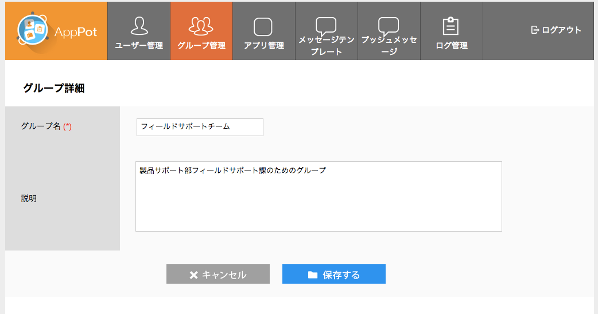
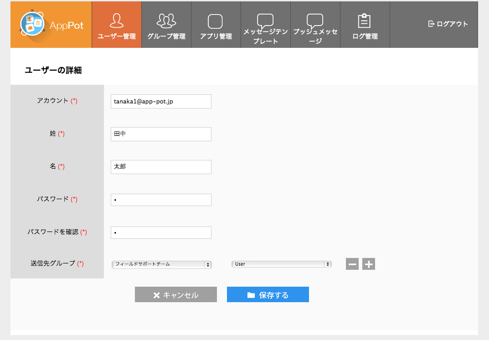
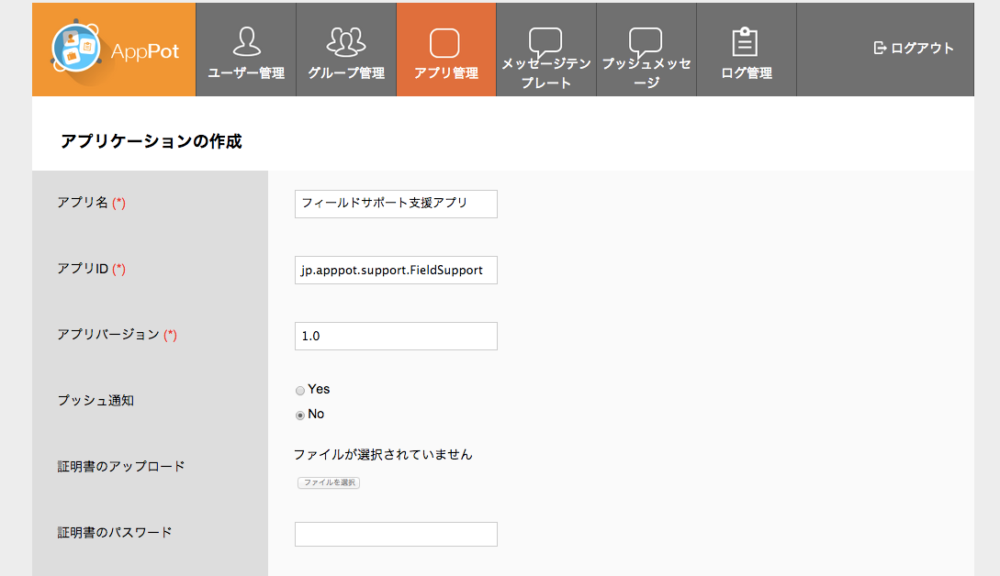
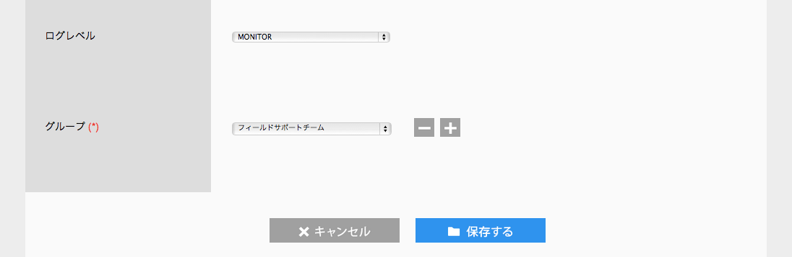

## AppPotを使うための準備
AppPotの環境を手に入れた後、AppPotを利用するために最低限行うべきは、グループの作成、ユーザーの作成とロールの設定、アプリの登録です。

どのようにグループを分けるか、どのようにロールを利用するのかを設計する必要があります。

グループは次の機能に関係します。

+ データの見える範囲

データの参照範囲をグループに指定した場合、同じグループに所属するユーザーにのみデータを共有することができます。

+ アプリの利用権限

アプリを使用可能なグループを定義することで、適切なユーザーのみがアプリを利用可能です。

+ プッシュメッセージの宛先

AppPotの管理画面からプッシュメッセージを送信する際に、対象のアプリとグループを指定できます。

ロールは次の機能に関係します。

+ 管理画面でできることが異なります。詳しくは下記のユーザーの登録を参照してください。
+ アプリ側でロールを使って処理を分けることができます。例えば、Managerロールのユーザーだけ承認機能を使わせる、と言ったことができます。 

### ルートユーザのログイン
AppPotには予めユーパーユーザーが用意されています。スーパーユーザーを作って、グループとユーザーを作成します。

グループを作成して、グループごとに管理ユーザーを作成することで、グループの中の作業を任せることもできます。

### グループの作成
グループメニューから、グループの作成を行います。

### ユーザーの登録

ユーザーのロールには次の種類があります。

+  Admin

管理者ロールです。管理者はグループ内のユーザーやアプリの登録やメンテナンスを行うことができます。
管理者は所属するグループのみ操作を行うことができます。

+  Manager

マネージャーユーザーです。
管理画面にログインして、他のユーザーを参照することができます。

+  User

一般ユーザーです。
アプリを使用することはできますが、管理画面にログインすることはできません。

### アプリ情報の登録
アプリの情報を登録します。
アプリの名前、ID、バージョン、ログレベル、アプリを使用できるグループの指定は必須で行う必要があります。
アプリIDにコロン(.)以外の記号を使用することはできません。

Push通知を行いたい場合はPush通知を「はい」にして、APNS（Apple Push Nortification Service）からアプリごとに発行された証明書とそのパスワードを登録してください。
APNSへの登録方法は[AppleのApplePushServiceの記述](https://developer.apple.com/library/ios/documentation/NetworkingInternet/Conceptual/RemoteNotificationsPG/Chapters/ApplePushService.html)を参照して下さい。

Appキーは不正なアプリがアクセスしないように、アプリレベルでの認証を行うために使用します。

アプリ情報の登録後、アプリ開発者にアプリID、バージョン、AppキーをAppPotの接続先情報と合わせて共有してください。

アプリの配布はMDMや、AppStoreなどを使用して別途行います。

# モバイルアプリの開発

## モバイルアプリの配布
## アプリのバージョンアップ
アプリを運用してく上で、アプリの仕様が変わっていきます。その時に、どのようなバージョンアップを行うか検討する必要があります。

どのようなバージョンアップがあるのでしょうか。

+ 画面に項目が増える
+ データのレイアウトが全然違う

大きくアプリの仕様が変わる場合（例えばデータベースや、Web APIのインターフェイスの構造が変わるような場合です）、一度に切り替えるビッグバン方式か、部門ごとなど徐々に行こうしていく場合があります。
ビックバン方式の場合、システムを一時的に停止させたり、移行に失敗した場合の影響が大きいです。
順次移行の場合、影響範囲を小さく行えることがメリットとしてあげられますが、逆に新しいシステムと従来のバージョンを並行稼働させる必要があるため、一般的にコストがあがります。

AppPotでは複数のバージョンのアプリを並行稼働させるために仕組みを備えています。

管理画面からバージョンごとにアプリを登録することができます。異なるバージョンのアプリは別々のデータベースの領域を使用しますので、別々のデータのレイアウトで同時に稼働することができます。

