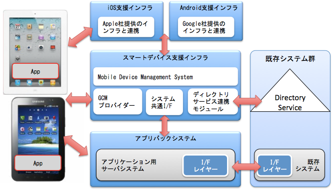
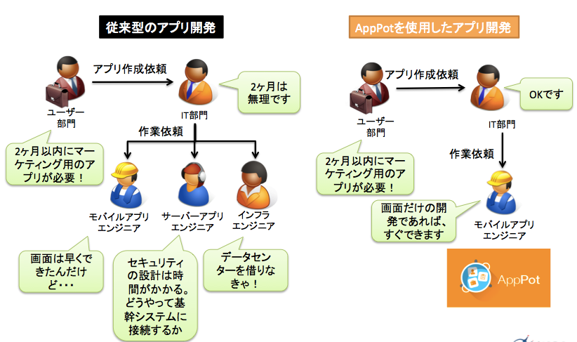

# AppPotの概要

AppPotの開発元であるNCデザイン＆コンサルティングは企業向けスマートデバイス導入や、モバイルアプリ開発のコンサルティングサービスを行っています。

クライアントは既に数多くのモバイルアプリを運用されている企業であったり、これから業務やマーケティングにモバイルを活用しようとしている企業でしたが、その中で多くのクライアントが次のような課題を持っていました。

* アプリを多数作成したいが、コストがかかってしまう
* アプリ開発のスピードが業務ニーズに追いついていない
* カタログアプリや、既存のWebのグループシステムをブラウザベースで使用しているが、コアな業務に活用できていない

私たちはそのような課題に対して、コンサルティングサービスという形でアーキテクチャを設計したり、システム開発をおこなって問題解決を行ってきました。

そのような活動の中で、これまで多くのプロジェクトで提供したコンセプトやアーキテクチャを実装したプロダクトを出して問題解決をより短期で行おうと考えたのがAppPotです。

AppPotは次のような特徴を持ったモバイル向けの実行プラットフォームです。

* 企業向けの共通機能

多くのモバイルアプリを開発、運用する際にそのアプリの画面やビジネスロジックは様々ですが、セキュリティやユーザーやデータの管理はほぼパターンがあります。
AppPotではアプリごとに共通的な処理を製品機能として提供します。（表１参照）

* サーバー開発を行わずスピーディーにアプリ開発が行える

* 既存システムとの連携を仕組み化して、連携方法の共通化や、セキュリティの担保

表１）AppPotの機能一覧

| 機能名 | 説明 |
|:--|:--|
| ログイン／ログアウトなどの認証 | 事前に登録したグループ、ユーザーの情報を元にモバイルアプリを使用するユーザーの認証を行う |
| グループ、ユーザー及びアプリの権限管理 | グループ、ユーザーを登録・管理する管理画面が提供される |
| 端末とサーバー間のデータの同期 | アプリ開発時に行ったデータ定義を元にサーバー側のデータベースが自動生成され、アプリ側でデータの操作を行うとサーバー側に自動で反映される | 
| アプリの使用状況のモニタリング | アプリの使用状況やエラーの内容をサーバーに集約して、ファイルにエクスポートすることができる。ファイルは分析ツールを用いて分析する |
| プッシュメッセージの送信 | AppPotの管理画面からAPNS（Apple Push Notification Service）や、GCM（Google Cloud Messaging）を利用してモバイルアプリのプッシュメッセージを送ることができる |
| 端末内のデータの暗号化 | 設定ベースでモバイルアプリ内のデータを暗号化することがでる。暗号化の設定を行った場合、事前に暗号化してから端末に保存されるため、端末の電源が入っていない状態でディスクにアクセスされてもデータを読むことができない |
| トランザクション制御によるデータの信頼性の確保 | モバイルアプリとサーバー間のトランザクションを制御し、ネットワークの問題などで同じメッセージが重複して送られた場合に２つ目以降を破棄する |
| 他システムとの連携 | モバイルアプリから簡単にデータベースやWebサービスなどの他システムを呼び出すことができる |

## モバイルアプリのアーキテクチャ上の特徴

モバイルアプリのアーキテクチャは従来のWebのシステムとは何が違うのでしょうか。

1. モバイルはクライアント・サーバーモデルである。
1. モバイルアプリは社外で使用されるため、社内で使用されるシステムよりもセキュアである必要がある
1. モバイルアプリは数を沢山作る。
1. AppleやGoogleを始めとする外部のサービスと連携する

### あるべきアーキテクチャ
この章ではモバイルアプリそのものではなく、モバイルアプリを組み込んだ企業システムのあるべきアーキテクチャについて扱います。

このような特徴を考慮し、モバイルアプリを使用する場合のリファレンス・アーキテクチャを作成しています。

* AppleのAPNS、GoogleのGCMと連携するための共通コンポーネントを用意し、各アプリはそれを利用する
* 社内のActive Directoryなどと連携した共通のユーザー管理
* モバイルアプリ向けのに既存システムのインターフェイスを公開する基盤を用意し、モバイルアプリは既存システムのシステム構成には依存させない。インターフェイス基盤で社外からのアクセスに対して横串でセキュリティをかける
* モバイル端末を管理するためのMDM（Mobile Device Management）製品

### AppPotの論理アーキテクチャー
AppPotは一般的なスマートデバイスのリファレンス・アーキテクチャのうち、MDM以外の機能を提供しています。

AppPotは共通機能を提供するWeb API、AppPotの制御情報やアプリのデータを格納するデータベース、そして管理画面から構成されます。

複数のアプリを共通のプラットフォームで管理するコンセプトとなっているため、複数のアプリを運用したとしてもAppPotは同じものを利用できます。

# 開発プロセス
一般的なモバイルの開発では以下のようなタスクがあります。

1. 要件定義
1. モバイルアプリのUIやサーバー側のAPIのインターフェイス定義、データベース設計
1. モバイルアプリの設計・開発・テスト
1. サーバー側の内部設計
1. 非機能要件の定義とインフラの見積もり
1. 非機能要件に応じたインフラの調達
1. インフラの設計・構築

AppPotを利用することで、サーバー側のインフラの調達、サーバーアプリの設計・開発が不要です。また、認証などの共通機能を設計開発する必要がありません。

特にモバイルを使用するようなシーンでは、ビジネスの変化が早いため、その変化にITが素早く、柔軟に対応できることはシステム構築のコスト削減以上に大きな価値があります。

