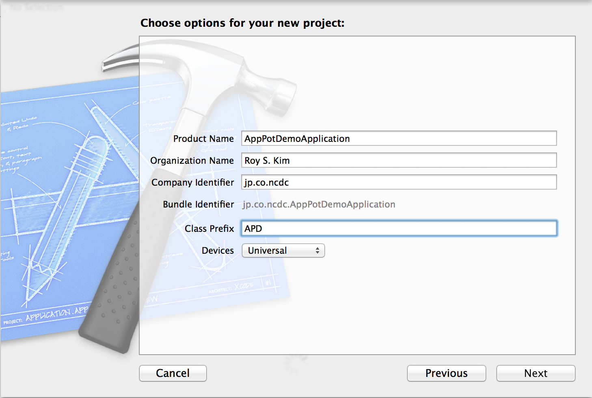
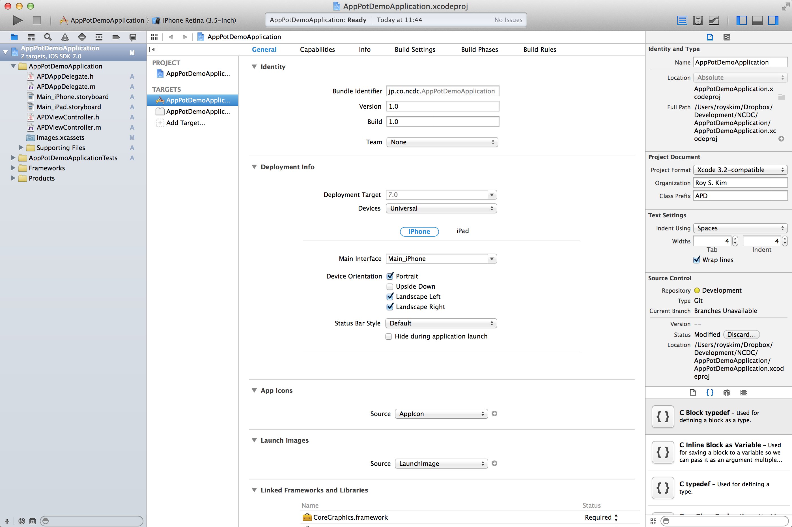
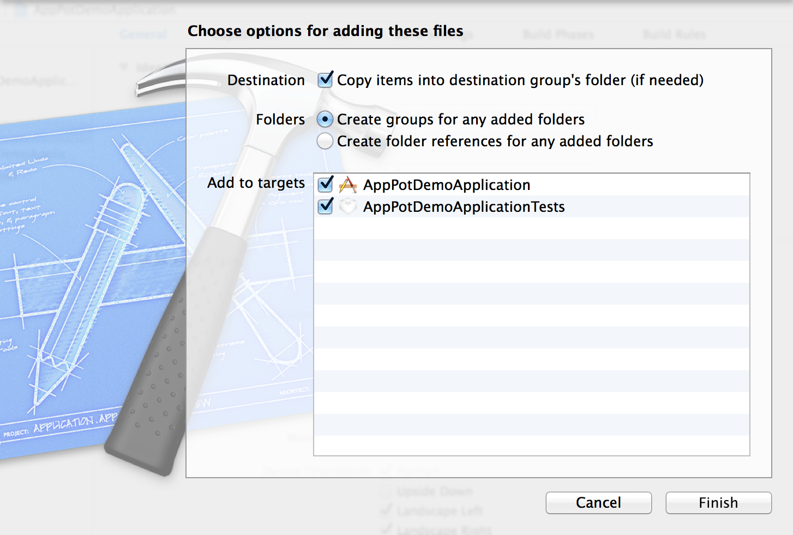
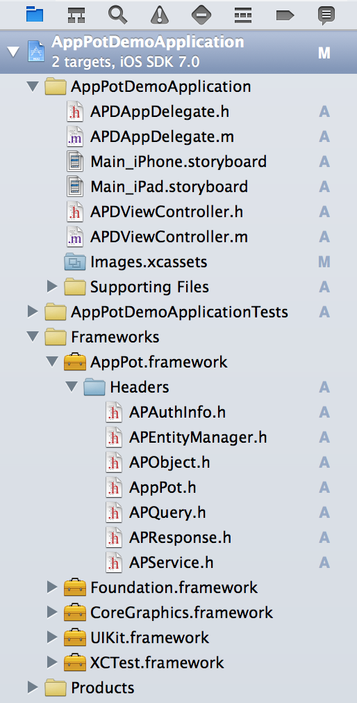
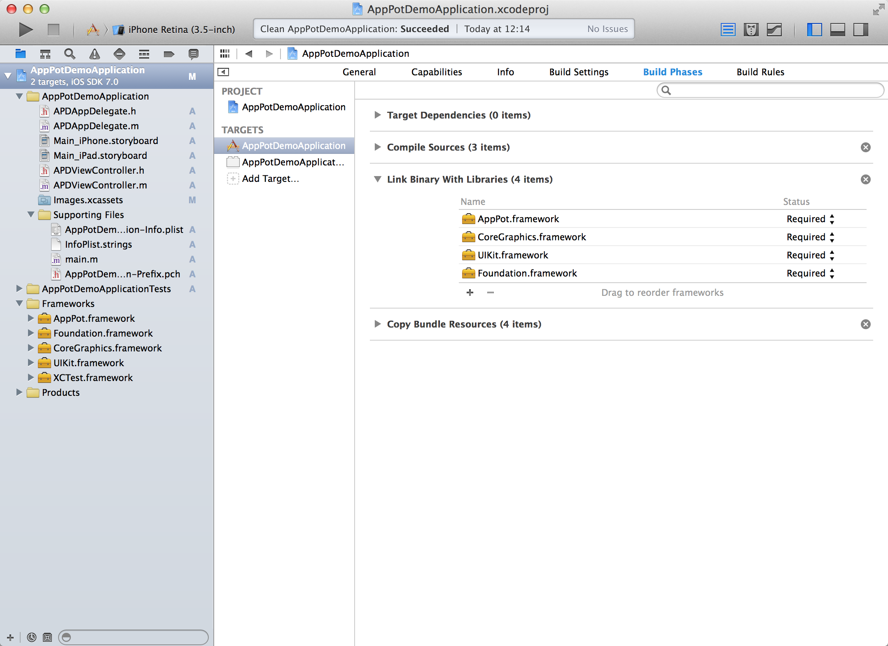
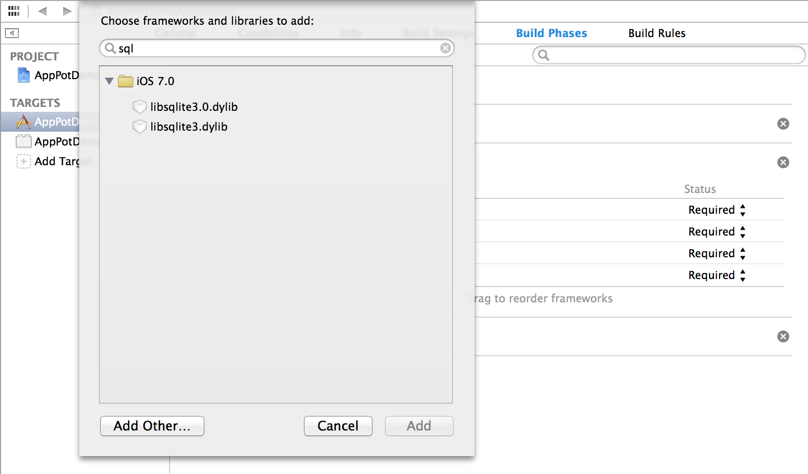
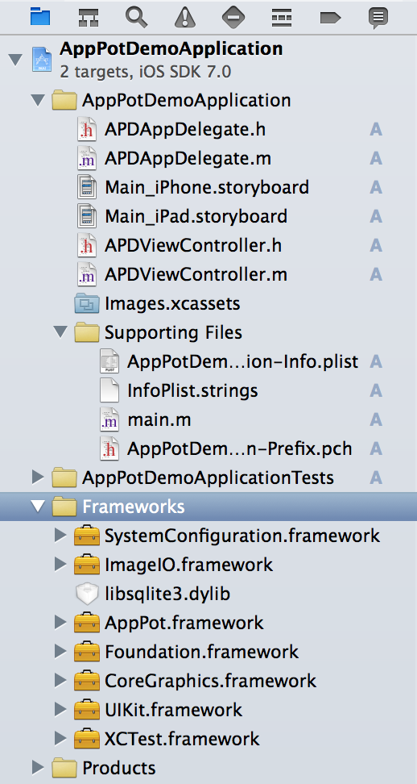
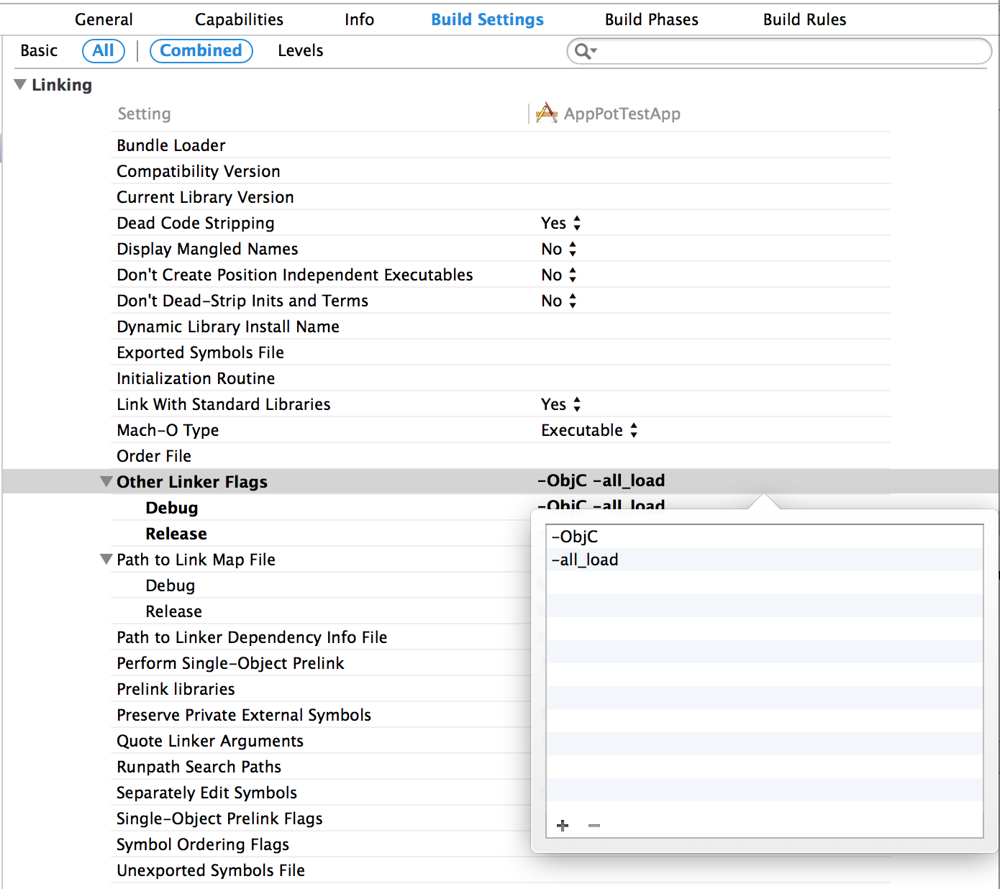

# AppPot SDK for iOS リファレンスガイド


## 概要

アプリ開発者はAppPot SDKを使うことでスマートデバイスで稼働するアプリをより迅速かつ効率的に作成できます。AppPot SDKは一般消費社向けのB2Cアプリ及びビジネスで活用するためのB2B、B2Eアプリの作成にも対応しております。特に強化されたセキュリティと企業システムとの親和力が特徴と言えます。AppPotのSDKはデータの安全な永続化処理、サーバーとの同期、トランザクション管理、オフライン対応、プッシュメッセージ対応等、どのアプリでも必要な機能をノンコーディングで利用できます。アプリの開発者は実装したい機能だけにフォーカスできます。

AppPotが提供する機能を使うためには以下の２つの方法があります。

- REST APIを利用
- AppPot SDKを利用

スマードでバイスのアプリではない、他システムやサービスからAppPotの機能を使うにはREST APIを利用します。REST APIを使うことでAppPotのほぼ全ての機能をSDKを通さず直接利用することができます。

アプリ開発の際にはAppPot SDKを利用することでREST APIを意識することなくOOPの手法だけでアプリを開発できます。AppPotはiOS、Android、JavaScriptに対応した３つのSDKを提供します。iOSとAndroid向けのSDKは各プラットフォームのネイティブアプリを作成するために使います。JavaScriptのSDKはビュー等にHTMLやCSSを利用してハイブリッドアプリを作成するために使います。（JavaScript版のSDKは近日公開予定です。）　制作するアプリの配布対象のプラットフォームと実装方式に適したSDKを選んで使って下さい。


### AppPot SDK for iOSがアプリ開発のために提供する機能

- Value Objectの定義によるデータモデルの自動生成
	- アプリ開発者がVOを定義してビルドすることで端末内とサーバー側にデータモデルが自動生成されます。 
	- データを保存する場所はValue Objectの属性の指定によって端末と、サーバー、あるいはその両方を指定できます。
	- 自動生成したデータモデルはVOの定義を変更することでいつでも修正できます。
	- 結果的にデータベースの作成及びサーバー側の開発が不要となります。
	
- データの操作機能の提供
	- Value Objectで定義したデータモデルはValue Objectを操作することで自動的に永続化処理が行われます。
	- 端末に保管したデータは定期的にサーバーのデータと同期され、常に最新の情報を保ちます。
	- 端末に保管するデータは寿命を指定し、端末内のストレージを無駄に使うことを防げます。
	- アプリ開発者はデータの永続化処理はAppPot SDKを任せて、各アプリ独自の処理を作ることに集中できます。
- ネットワーク処理の支援
	- 全てのネットワーク関連の処理はSDKによって隠蔽されます。アプリ開発者がネットワーク処理を意識する必要はありません。
	- 端末がオフライン状態でもSDKがユーザーの操作を記憶し、端末が再びオンラインになった時にサーバーに変更を反映することができます。
	- アプリ開発者は必要に応じてネットワークの同期処理と非同期処理を選択できます。
	
- 強化されたアプリのセキュリティ
	- 認証と認可はAppPot SDKによって自動的に行われます。認証と認可の処理はAppPotが提供する機能を使う事ができますが社内の既存認証システムと連携して使う事もできます。
	- ログイン、ログアウト及びユーザー権限に基づくデータの制御がSDKによって提供されます。もうアプリ毎に同様の機能を作る必要がありません。
	- ユーザーの認証情報は各プラットフォーム内の安全な場所に暗号化して保存されます。また端末に保持する情報はValue Objectの指定によって選択的に暗号化できます。悪意を持つ人が端末のアプリの内部を直接覗いても重要な情報が簡単に漏洩されることはありません。
		
- アプリ使用状況のモニタリング
	- AppPot SDKが提供するモニタリング機能を使うことでアプリの使用状況をモニタリングできます。
	- モニタリングのレベルはAppPotの管理画面から設定を変えることでアプリの運用中にも必要に応じて随時変更できます。
	- モニタリング情報を活用することでアプリのKPIを測定し、更なる改善等に活用できます。
	
- プッシュメッセージの利用
	- AppPot SDKを使ってデバイスを登録しておくとAppPotの管理画面から各アプリに対して簡単にプッシュメッセージの送信ができます。
	- プッシュメッセージの送信先はユーザーが属するグループ単位で制御できます。
	- よく使うプッシュメッセージはテンプレートとして登録し、より効率的に使うことができます。
	

## AppPot SDKを利用した開発の流れ

以下にAppPot SDKを利用したアプリ開発の流れを示します。


		・図：AppPot SDKを利用した開発の流れ
		

## AppPotサーバーの準備

アプリ開発に入る前に先ずサーバー側の管理画面からアプリを新規登録する必要があります。アプリを登録する際にはアプリを使用できるグループを指定する必要がありますので、AppPot管理画面からグループとそれに属するユーザーを定義してあることが前提となります。以下にAppPot SDKを使う前に管理画面で行うべき作業を記述します。各作業の詳細については管理画面のマニュアルを参照して下さい。

- グループとユーザーの登録
- アプリ情報の登録
- プッシュメッセージ送信用証明書の登録(オプション)


## AppPot SDKの導入

### AppPot SDKのダウンロード

[AppPotのサイト](http://app-pot.jp/)から最新のAppPot SDKをダウンロードします。AppPot SDKはzipファイルとして圧縮されております。ダウンロードが終わったら圧縮を解凍します。解凍後のファイル名は「AppPot.framework」となります。

### AppPot SDKのインポート
アプリ開発に使用するIDEを開き、ダウンロードしたApPot SDKを追加します。ここではXcodeを前提にした説明をします。Xcodeはアップルの[AppStoreから無償で入手](https://developer.apple.com/xcode/)できます。Xcodeは4.x以上のバージョンなら問題ありませんが、常に最新のバージョンを使うことをおすすめします。

また、この文書ではAppPot SDKの使用と関係のないXcodeの操作方法の詳細は記述しません。Xcodeの操作方法の詳細は別の書籍や[アップルの文書](https://developer.apple.com/jp/devcenter/ios/library/documentation/Xcode_Overview.pdf)を参考にして下さい。

既にアプリを開発するためのプロジェクトを作成している場合はそのプロジェクトをXcodeで開きます。ここではXcodeから新規プロジェクトタイプの「Single View Application」を選んで「AppPotDemoApplication」という名前のアプリを作成するプロジェクトをサンプルとして使用します。



新しいプロジェクトを作成すると下図のような初期設定済みのプロジェクトが表示されます。



先ほどダウンロードした「AppPot.Framework」ファイルをプロジェクト内の「Frameworks」フォルダにドラッグアンドドロップします。フレームワークをインポートする時のオプションを選択できるウィンドウが表示されます。下図のような設定にして「Finish」ボタンをクリックします。この操作によってAppPot SDKがプロジェクトにインポートされます。なお、下図では「AppPotDemoApplicationTests」というターゲットにも追加しておりますが、テストコードを記述しない場合はこのチェックは外します。




XcodeのFrameworksフォルダを開き、AppPot.frameworkをクリックして開いてみたらAppPot SDKが提供するヘッダーファイルを確認できます。



AppPot SDKを使うためには他にいくつかのライブラリーをプロジェクトにインポートする必要があります。下図の通り、AppPotDemoApplicationターゲットからBuild Phases、更にLink Binary wiht Librariesを選択します。次は「+」ボタンをクリックしてライブラリーを追加します。



検索窓を利用して以下のライブラリーを追加します。

- libsqlite3.dylib
- ImageIO.framework
- SystemConfiguration.framework




上記のライブラリーを登録するとプロジェクトフォルダは下図のようになります。




最後に、プロジェクトのターゲットからBuild Settingsを選択し、Other Linker Flagsに「-ObjC」と「-all_load」というオプションを追加します。




*もし、これ以降のビルドやアプリの実行等でAppPotのヘッダーファイルが見つからない等のエラーが出る場合はBuild Settingsの各種パス(Serarch Paths)の設定値を確認してください。上記の手順や指示に沿って操作しなかった場合は手動でパスを指定する必要があるかも知れません。*


これで、ソースコードからAppPot SDKが提供するヘッダーファイルが使えるようにします。Supporting Filesというフォルダの中にあるAppPotDemoApplication-Prefix.pchを言うファイルを開き、ファイルの最後の部分にインポート文を追加します。

````objc
#import <Availability.h>

#ifndef __IPHONE_5_0
#warning "This project uses features only available in iOS SDK 5.0 and later."
#endif

#ifdef __OBJC__
    #import <UIKit/UIKit.h>
    #import <Foundation/Foundation.h>
#endif

// 以下の行を追加
#import <AppPot/AppPot.h>

````

これでAppPot SDKを使うための準備は終わりました。次からは実際にAppPot SDKを使う方法について記述します。


## AppPot SDKを利用したアプリの開発

### AppPot SDKの初期化
アプリからAppPotを使うためには初期設定が必要です。AppDelegate.mファイルを開き、- (BOOL)application:(UIApplication *)application didFinishLaunchingWithOptions:(NSDictionary *)launchOptionsを以下のように編集します。


````objc
#import "AppDelegate.h"
#import "NSData+DeviceToken.h"

@implementation AppDelegate

- (BOOL)application:(UIApplication *)application didFinishLaunchingWithOptions:(NSDictionary *)launchOptions
{
	// Override point for customization after application launch.
	
	[self initAppPotSDK]; // この行を追加する
	
    return YES;
}
````

また、AppDelegate.mファイルにinitAppPotSDKメソッドを追加します。このメソッドの中でAppPot SDKの初期化に必要な設定を行います。<font color=red>初期設定のAPIが変わったので以下のコードを修正する必要がある。</font>

````objc

- (void)initAppPotSDK
{
	[[APService sharedInstance] setAppID:@"jp.co.ncdc.AppPotDemoApplication" // 管理画面で登録したアプリのID
                              appVersion:@"1.0" // 管理画面で登録したアプリのバージョン
								hostName:@"00.000.000.000" // AppPotServerのホスト名、あるいはそのURLを記述 
                             contextRoot:@"/StewSprint5"
					  customHeaderFields:nil
							  portNumber:8080];    
}

````

設定する情報は管理画面で指定したアプリのIDやバージョン、そしてAppPotサーバーの情報です。必要に応じてカスタムヘッダーをNSDictionaryの型で作成して追加することもできます。AppPot SDKはここに設定された情報に基づいてAppPotサーバーとのやりとりを行います。この設定情報が正しくない場合、AppPot SDKは正常に機能できません。
<font color=red>ここでダミーのValue Objectを一個作ろう。</font>

ここまでできたらアプリをビルドして実行してみましょう。AppPot SDKの導入及び初期化が問題なく行われていればビルドに成功し、実行した結果以下のログが表示されます。

````objc
AppPot: Good Job! AppPot SDK is initaialized successfully.
````

もし実行中にネットワークに繋がってない場合は以下のような内容が出力されます。ネットワークが繋がっているか確認してから再度実行して下さい。

````objc
AppPot: Your device is offline. AppPot SDK could not access to the server. To make sure your setting is correct, please do this again while your network is available.
````

AppPot SDKへの設定内容が適切でない場合は以下のような文章が出力されます。上記のAppPot SDKの設定情報を確かめてから再度実行して下さい。

````objc
AppPot: AppPot SDK cannot connect to server properly. Please make sure that your setting for AppPot SDK is correct and try again.  Server response is as follows : [サーバーからのレスポンス]
````

また、AppPot SDKに登録するValue ObjectがAPObjectの子クラスとして宣言されていない場合は以下のようなログが出力されます。

````objc
AppPot: Below classes cannot be registered into SDK because they are not subclasses of the APObject. : [問題を起こしたクラスの一覧]
````

このメッセージが表示されたら問題を起こしたクラスのヘッダーファイルを確認し、APObjectの子クラスとして宣言されているかを確認して下さい。

AppPot SDKには上記の他により多様な設定項目を提供しております。AppPot SDKの設定項目の詳細については[APServiceクラスの文書を](iOS_SDK_ClassReferences/html/Classes/APService.html)参照して下さい。

## Value Objectの定義

AppPot SDKの初期化が終わったら次はアプリで使うデータを表現するValue Objectを定義します。Value ObjectはAppPot SDKから提供するAPObjectの子クラスとして定義する必要があります。APObjectの子クラスとして定義したクラスをAppPot SDKに登録することでデータの操作をAppPot SDKによって自動化できます。

APObjectの子孫クラスにすることは必須ではありません。しかし、APObjectの子クラスで定義すればAppPot SDKが提供するデータ管理機能が使えるようになり、アプリ開発が簡単になります。アプリ作成のコストを低減するためにも、アプリ内のアーキテクチャを一貫性あるものにするためにもAPObjectを継承することをお勧めします。

Value Objectの宣言は以下の二つのパーツに区分して考える事ができます。
- Value Objectの属性（データタイプ）の宣言
- Value Objectの振る舞いの指定

以下にAPObjectの子クラスとして定義したCaseReportとFollowというクラスを使って定義の例を示します。

### Value Objectの属性（データタイプ）の宣言

各Value Objectは複数の属性で一つの固まりのデータを示します。データの属性はClassのpropertyとして定義します。これは定義するクラスの親クラスをAPObjectに指定する他には普通のObjective-Cのクラスの定義と何も変わりがありません。必要な属性をpropertyとして自由に定義できます。


````objc
#import <Foundation/Foundation.h>

@class Follow;

@interface CaseReport : APObject // APObjectを親クラスとして宣言

// VOに必要な属性を自由に定義
@property (nonatomic, strong) NSString* objectId;
@property (nonatomic, strong) NSInteger age;
@property (nonatomic) NSInteger gender;
@property (nonatomic) BOOL isFollow;
@property (nonatomic, strong) NSString * memo;
@property (nonatomic, strong) NSString * patientName;

@end
````


````objc
#import <Foundation/Foundation.h>

@class CaseReport;

@interface Follow : APObject // APObjectを親クラスとして宣言

// VOに必要な属性を自由に定義
@property (nonatomic, strong) NSString* objectId;
@property (nonatomic, strong) NSNumber * alphaBlocker;
@property (nonatomic, strong) NSNumber * arb;
@property (nonatomic, strong) NSNumber * betaBlocker;
@property (nonatomic, strong) NSNumber * ca;
@property (nonatomic, strong) NSDate * date;
@property (nonatomic, strong) NSNumber * diuretic;
@property (nonatomic) float ace;
@property (nonatomic) double maxBloodPressure;
@property (nonatomic) double minBloodPressure;
@property (nonatomic, strong) NSString * memo;
@property (nonatomic, strong) NSNumber * neurodepressant;
@property (nonatomic, strong) NSString *caseReportID;

@end
````


### Value Objectの振る舞いの指定

Value Objectが継承するAPObjectでは複数の設定項目が用意されてあり、それに適切な値を設定することでValue Objectの振る舞いを制御できます。各Value Objectの設定は- (void) setDefaultPropertiesメソッドの中で行います。ここで設定しない項目に対してはデフォルトの値が使われる事となります。

以下にCaseReportと言うValue Objectに振る舞いを指定する例を示します。

````objc

//  CaseReport.m

#import "CaseReport.h"
#import "Follow.h"

@implementation CaseReport

- (void) setDefaultProperties {
    self.persistentType = APPersistentLocalAndServer; // データの保持場所を端末内とサーバーの両方に指定する。
    self.isAutoRefresh = TRUE;                        // データをサーバーのデータで自動更新を行う。
    self.autoRefreshInterval = 1800;                  // 自動更新の間隔を30分に指定.
    self.lifeSpan = 86,400;                           // データの端末内での保持期間を24時間に指定.
}
@end

````

以下にFollowと言うValue Objectに振る舞いを指定する例を示します。Followクラスについてはデータの保持場所を端末内だけに指定しているだけで、他についてはデフォルトの設定をそのまま踏襲してあります。


````objc

//  Follow.m

#import "Follow.h"
#import "CaseReport.h"

@implementation Follow

- (void) setDefaultProperties {
    self.persistentType = APPersistentLocalOnly; // データを端末内にだけ保持するように指定。
}
@end

````

Value Objectの振る舞いを指定する設定項目は下記の通りです。

#### データの保持場所の指定
- persistentType : 何も指定しない場合はデフォルトでサーバー側にのみ保存することになっています。以下のいずれを選択できます。


````objc

/*!
 @abstract データの保持場所を指定するための定数定義。
 @discussion 定義順に、サーバーだけにデータを保持、端末内だけに保持、そして端末とサーバーの両方にデータを保持することを示す。SDKのデフォルト値はAPPersistentServerOnlyである。
 */
typedef NS_ENUM(NSInteger, PERSISTENT_TYPE) {
	APPersistentServerOnly,       // サーバーだけに保持します。
	APPersistentLocalOnly,        // 端末内だけに保持します。
	APPersistentLocalAndServer    // 端末内とサーバーに保持します。
};

````

#### データの自動更新の指定

これはデータの保持場所が端末内及びサーバー側の両方(APPersistentLocalAndServer)が指定された場合のみ有効な指定です。その他の保持場所が指定されている場合は以下の設定は無視されます。

- isAutoRefresh : 該当データが自動更新対象であるかの指定。この設定はpersistentTypeがAPPersistentLocalAndServerの場合のみ有効です。この属性の値をYESにした場合、AppPot SDKは該当データを後述する条件で自動更新し、端末内のデータを最新のものに保ちます。
- autoRefreshInterval : 自動更新の間隔を秒数で指定します。AppPot SDKはこの値を使って定期的にサーバーのデータを確認し、端末のデータを最新の状態に更新します。
- scopeTypeForAutoRefresh : 自動更新するデータの権限の指定。ユーザー、グループ、全部から指定可能です。


#### データの権限の指定

該当するValue Objectを利用できる権限を指定します。以下のいずれかを指定できます。

````objc
/*!
 * @abstract データの権限を指定するための定数定義。
 * @discussion 定義順に、全使用者が使用可能、同じグループの人が使用可能、データの作成者だけが使用可能であることを示す。SDKのデフォルト値はAPScopeGroupである。
 */
typedef NS_ENUM(NSInteger, SCOPE_TYPE) {
    APScopeUser = 1, // データを作成したユーザーだけが参照・編集できる。
    APScopeGroup,    // データを作成したユーザーと同じグループに属するユーザーだけが参照・編集できる。
    APScopeAll       // 誰でもデータを参照・編集できる。
};

````

#### 暗号化する属性の指定

Value Objectの属性は暗号化することができます。暗号化はデータを端末に保持されるValue Objectに対してのみ適用されます。暗号化されたデータはアプリが使用する際には自動で複号化されメモリーにロードされます。この指定によって重要なデータを安心して端末の中に保持することができます。

以下にデータの暗号化の指定に使う属性を示します。

````objc
/*!
 * @abstract このデータが暗号化対象の属性を持つか否かの指定
 * @property hasEncryptedProperties
 *
 * @discussion 暗号化する必要がある属性がある場合はYESを指定する。
 */
@property (nonatomic) BOOL hasEncryptedProperties;

/*!
 * @abstract 暗号化対象の属姓名を指定する。
 * @property encryptedProperties
 *
 * @discussion この属性はhasEncryptedPropertiesがYESの場合のみ評価される。
 */
@property (nonatomic, strong) NSArray* encryptedProperties;

````

暗号化や複合化処理はAppPot SDKによって自動的に行われるのでアプリの開発者は上記のPropertyを指定するだけで、処理を意識する必要はありません。


## Value Objectのの登録


Value Objectの定義が終わったらAppPot SDKに定義したValue Objectを登録します。登録するには先述したinitAppPotSDKメソッドに以下のコードを追加します。


````objc

- (void)initAppPotSDK
{
	[[APService sharedInstance] setAppID:@"jp.co.ncdc.AppPotDemoApplication" // 管理画面で登録したアプリのID
                              appVersion:@"1.0" // 管理画面で登録したアプリのバージョン
								hostName:@"00.000.000.000" // AppPotServerのホスト名、あるいはそのURLを記述 
                             contextRoot:@"/StewSprint5"
					  customHeaderFields:nil
    
	// Value ObjectをAppPot SDKに登録するために、以下の行を追加する
    // ①AppPot SDKが管理するValue Objectの一覧を作成する。
    NSArray *valueObjects = @[
                              [CaseReport class],
                              [Follow class]
                              ];
    
    BOOL createOrUpdateDataBase = YES; // サーバー側のDBを新規作成、修正する場合のみYESにする。
    
	// ②AppPot SDKにValue Objectを登録する。 
    [[APEntityManager sharedInstance] registerValueObjects:valueObjects isRecreate:createOrUpdateDataBase withBlock:^(NSError *error) {
        if(error) {
            NSLog(@"Error while creating DB :: %@", error);
            APLogError(@"Error while creating DB :: %@", error);
        }
    }];
    
}

````


上記①以下のコードでAppPot SDKに登録して自動的に管理するValue Objectの一覧を配列として作成し、②以下のコードでAppPot SDKに登録しています。上記の記述によってアプリ起動の直後、AppPot SDKは登録されたValue Objectを解釈し、必要に応じて端末内やAppPotのサーバーに各Value Objectの値を格納するためのデータ保存場所を作成します。端末内でデータはValue Object単位でテーブルが作成され、SQLiteデータベースにデータが格納されます。

ただし、毎回上記の処理が行われるのはあまり効率的ではありません。初回のアプリ実行でデータベースが作成されたら、上記のcreateOrUpdateDataBaseの値をNOに変えてデータベースの生成処理はスキップします。アプリの開発中にValue Objectの定義を変えた場合にはまたcreateOrUpdateDataBaseの値をYESに変えて一回アプリを起動することで変更をデータベースに反映します。

これで全ての準備は終わりました。これからは普通のアプリの作り方に基づいて、アプリの画面や画面遷移を自由に作成します。アプリの各画面で必要なデータは各Value Objectを利用することで新規作成、照会、編集、削除等の操作ができます。

Value Objectの操作方法の詳細は次の章を参照して下さい。

## AppPot SDKを利用したデータ(Value Object)の管理

AppPot SDKはアプリで使用するデータの操作を簡単に行うために[APObject](iOS_SDK_ClassReferences/html/Classes/APObject.html)というクラスを提供します。アプリの開発者はアプリで使うデータを[APObject](iOS_SDK_ClassReferences/html/Classes/APObject.html)の子クラスとして定義し、AppPot SDKに登録することでデータの操作やネットワークを経由したサーバーとのやり取り、オフライン時の対応、そしてそれらの処理にまつわるエラー処理等をAppPot SDKに任せて、アプリの画面遷移やビューの処理に集中できます。以下にAPObjectの子クラスとしてのValue objectに対する操作方法を示します。

### 新規データの作成

新規データの作成は普通のクラスのインスタンス生成と同じです。以下にCaseReportのデータを新しく一つ生成する例を示します。

````objc

CaseReport *newReport = [[CaseReport alloc]init];

newReport.paitentName = @"Yamada";
newReport.age = 44;
newReport.gender = 1;
newReport.isFollow = YES;

NSError *error = nil;
newReport = [newReport saveObject:&error];

if(error){
	// 保存に失敗した場合のエラーハンドリングの記述
}
````
saveObjectメソッドが呼ばれるまではデータはメモリー上に存在するだけです。saveObjectを呼んだ時にデータの保存処理が行われます。データの保存に成功するとnewReportのobjectIdと言う属性に値が設定されます。objectIdはデータのユニークなキーであり、一件のデータの固有な識別子として使うことができます。

saveObjectは以下の二つの種類があります。

````objc
/*!
 *  @abstract このオブジェクトの情報をデータストーアに同期型で反映する。保存先のデータストーアはpersistentTypeによって制御される。
 *  @param error オブジェクトの更新中に発生したエラーを格
 *  @return object. 保存されたオブジェクトを返す。
 *  @discussion
 *  このメソッドはオブジェクトの状態によってデータストーアに新しいデータを追加、あるいは既存のデータを更新する。新しいデータであるか否かはobjectIdの有無で判断する。objectIdがない場合は新しいデータとして追加する。
 */
- (APObject*) saveObject:(NSError **)error;


/*!
 *  @abstract このオブジェクトの情報をデータストーアに非同期型で反映する。保存先のデータストーアはpersistentTypeによって制御される。
 *  @param ブロック オブジェクトの更新が終わった後に実行されるコードを渡す。
 *  @return objectId. 保存されたオブジェクトの識別子を返す。
 *  @discussion
 *  このメソッドはオブジェクトの状態によってデータストーアに新しいデータを追加、あるいは既存のデータを更新する。新しいデータであるか否かはobjectIdの有無で判断する。objectIdがない場合は新しいデータとして追加する。
 */
- (void) saveWithBlock:(APObjectResultBlock)block;

````

saveObjectメソッドは同期で、saveWithBlockメソッドは非同期で処理されます。つまり、saveObjectメソッドは処理が終わるまでアプリの画面及び他の処理が待たされることとなります。処理の順が必ず守られる必要がある場合を除いてはsaveWithBlockを使った方が効率的です。

※AppPot iOS SDKの殆どのメソッドは同期型と非同期型のメソッドを提供します。非同期型のメソッドはWithBlockで終わる名前となっています。

データが保存される場所は各クラスの設定によって異なります。上記の例で使っているCaseReportクラスはpersistentTypeがAPPersistentLocalAndServerに設定されているためデータは端末内のデータベースとサーバー側に保存されます。saveObjectメソッドが呼ばれた時点で端末がオフラインの状態である場合はデータは端末内だけに保存され、後でオンラインになった時点でサーバー側にもデータが送信され保存されます。つまり、端末がオフラインの状態では端末内とサーバー側に異なるデータを持つ事になる場合があります。


### 一件のデータの取得

各データのユニークなキーであるobjectIdを指定することで一件のデータを取得できます。APObjectクラスに定義されている以下のメソッドを使う事ができます。

````objc

/*!
 *  @abstract オブジェクトのユニークなキーであるobjectIdを指定して一件のデータを取得する。
 *  @param objectId 取得するデータのキー
 *  @param error エラーが発生した場合にエラーを格納するためのエラーインスタンスのポインター
 *
 *  @discussion
 */
+ (instancetype) objectWithId:(NSString *) objectId error:(NSError**)error;

````

以下に上記のメソッドを使う例を示します。

````objc
NSError *error = nil;
CaseReport *caseReport = [CaseReport objectWithId:@"" error:&error];

if(error){
	// エラー発生時の処理をここに記述
}

NSString *pName = caseReport.paitentName; // 取得したデータを使用する。

````


###  データの更新

一件のデータを変更するにはValue Objectのpropertyを修正し、以下のメソッドの何れかを使います。二つのメソッドの差は同期型に処理するか非同期型に処理するかです。

````objc
/*!
 *  @abstract このオブジェクトの情報をデータストーアに同期型で反映する。保存先のデータストーアはpersistentTypeによって制御される。
 *  @param error オブジェクトの更新中に発生したエラーを格
 *  @return object. 保存されたオブジェクトを返す。
 *  @discussion
 *  このメソッドはオブジェクトの状態によってデータストーアに新しいデータを追加、あるいは既存のデータを更新する。新しいデータであるか否かはobjectIdの有無で判断する。objectIdがない場合は新しいデータとして追加する。
 */
- (APObject*) saveObject:(NSError **)error;


/*!
 *  @abstract このオブジェクトの情報をデータストーアに非同期型で反映する。保存先のデータストーアはpersistentTypeによって制御される。
 *  @param ブロック オブジェクトの更新が終わった後に実行されるコードを渡す。
 *  @return objectId. 保存されたオブジェクトの識別子を返す。
 *  @discussion
 *  このメソッドはオブジェクトの状態によってデータストーアに新しいデータを追加、あるいは既存のデータを更新する。新しいデータであるか否かはobjectIdの有無で判断する。objectIdがない場合は新しいデータとして追加する。
 */
- (void) saveWithBlock:(APObjectResultBlock)block;

````

新規に作成したデータも既存データも更新には上記のメソッドを使う事ができます。AppPot SDKはobjectIdの有無を見て新規データか既存データかを判断します。その判断結果に基づき、新規データである場合はデータの挿入、既存データの場合はデータの更新処理が行われます。このメソッドの戻り値は変更等がデータベースに保存され、採番されたobjectIdが設定されたValue Objectとなります。

複数のデータを更新するにはAPEntityManagerクラスの以下のメソッドを使います。パラメータに更新対象のクラスを配列として渡します。

````objc
/*!
 *  @abstract 対象のデータオブジェクト一覧を保存する。この処理は同期型で行われる。
 *  @param list 保存するデータオブジェクトの一覧。
 *  @param error 発生したエラーを格納するためのエラーオブジェクト
 *
 *  @discussion 対象データオブジェクトが新規の場合は新規データの追加、既存のものである場合は既存データの更新が行われる。正常時は更新が終わったデータオブジェクトを返す。
 *
 */
- (NSArray*) saveListOfInstances:(NSArray*) list error:(NSError**)error;

````

### データの削除
データを削除するにはValue Objectの以下のメソッドの何れかを呼び出します。二つのメソッドの差は同期型で処理するか非同期型で処理するかです。

````objc
/*!
 *  @abstract データを同期型で削除する。
 *  @param   error データの削除の際に発生したエラーを格納する
 *
 *  @discussion
 *  
 */

- (BOOL) deleteObject:(NSError**) error;

/*!
 *  @abstract データを非同期型で削除する。
 *  @param   error データの削除の際に発生したエラーを格納する
 *
 *  @discussion
 *
 */
- (void) deleteObjectWithBlock:(APResponseResultBlock) block;
````

APEntityManagerクラスの以下のメソッドを使うことで複数のデータを一括で削除することもできます。

````objc
/*!
 *  @abstract 対象データオブジェクトの一覧を削除する。この処理は同期型で行われる。
 *  @property instance　削除するデータオブジェクト。
 *  @param error 発生したエラーを格納するためのエラーオブジェクト
 *
 *  @discussion
 *
 */
- (BOOL) deleteListOfInstance:(NSArray*)list error:(NSError**) error;
````

一つのValue Objectタイプの全てのデータを削除するにはAPEntityManagerクラスの以下のメソッドを使います。パラメータには削除対象のValue Objectのクラスインスタンスを渡します。該当する全てのデータが削除されるのでこのメソッドの使用には注意が必要です。

````objc
/*!
 *  @abstract 指定したクラスの全てのデータを削除する。
 *  @param _class
 *
 *  @discussion データストレージ内のデータが全て削除されるので使用には注意が必要。ローカルストレージでは物理削除、サーバー側では論理削除が行われる。
 *
 */
- (void) deleteAllDataFor:(Class)_class;
````

### データ一覧の取得

データの一覧の取得には[APQuery](./iOS_SDK_ClassReferences/html/Classes/APQuery.html)と言うクラスを使います。以下にAPQueryを使って特定のFollowと言うValue Objectの一覧を取得する例を示します。

````objc
NSError *error = nil;
    
APQuery *query = [APQuery queryWithClass:[Follow class]];// パラメータに取得するValue Objectのクラスインスタンスを渡す。
query.maxResult = 20; // 必要に応じて取得するデータの最大数を指定
query.pageIndex = 2;  // 必要に応じて取得するデータのページを指定
NSArray *follows = [query resultSet:&error]; // クエリの実行。
    
if(error){
	// エラー発生時のエラーハンドリングを記述
}
// 取得したデータの利用
````

上記のコードではFollowクラスの全てのデータを取得してNSArrayとして返します。[APQuery](./iOS_SDK_ClassReferences/html/Classes/APQuery.html)でデータの一覧を取得する際に以下のpropertyを設定できます。

- maxResult : 取得するデータの最大数
- pageIndex : 取得するデータをページングする場合、何回目のページかの指定


### データ取得条件の指定

単純にデータの一覧を取得するのではなく、条件を絞って取得するには[APQuery](./iOS_SDK_ClassReferences/html/Classes/APQuery.html)に対して検索条件を指定します。以下のメソッドの何れか、あるいは複数を組み合わせて検索条件を指定することができます。

````objc

/*!
 *  @abstract 取得するデータに対する条件を記述
 *  @param value 条件と比較する値
 *
 *  @discussion
 *  各メソッドが指定する条件はメソッド名を参照する。
 *
 */
- (void) whereKey:(NSString*) columnKey equalTo:(id) value;
- (void) whereKey:(NSString*) columnKey notEqualTo:(id) value;
- (void) whereKey:(NSString*) columnKey greaterThan:(id) value;
- (void) whereKey:(NSString*) columnKey greaterThanOrEqual:(id) value;
- (void) whereKey:(NSString*) columnKey lessThan:(id) value;
- (void) whereKey:(NSString*) columnKey lessThanOrEqual:(id) value;
- (void) whereKey:(NSString*) columnKey like:(NSString*) value;
- (void) sortByKey:(NSString*) columnKey sortType:(SORT_TYPE) sortType;
- (void) scopeType:(NSInteger) scopeType;

````

以下に[APQuery](./iOS_SDK_ClassReferences/html/Classes/APQuery.html)に取得するデータの条件を指定するための処理の例を示します。

````objc
NSError *error = nil;
    
APQuery *query = [APQuery queryWithClass:[Follow class]];

// 検索条件の指定。以下では２つの条件がANDで指定される。
[query whereKey:@"caseReportID" equalTo:selectedCaseReport.objectId];
[query whereKey:@"caseReportID" greaterThan:selectedCaseReport.age];

NSArray *follows = [query resultSet:&error];
    
if(error){
	// エラー発生時のエラーハンドリングを記述
}
// 取得したデータの利用
````
##AppPot SDKが提供する機能

[APObject](iOS_SDK_ClassReferences/html/Classes/APObject.html)を継承したValue Objectを利用したデータの管理の他に、AppPot SDKは[APService](./iOS_SDK_ClassReferences/html/Classes/APService.html)クラスを通していくつかの便利で再利用性が高い機能を提供します。以下にその機能を説明します。

### APServiceクラスのシングルトンインスタンスの取得
以下のクラスメソッドを利用して[APService](./iOS_SDK_ClassReferences/html/Classes/APService.html)のインスタンスを取得します。

````objc
/*!
 *  @abstract APServiceクラスのシングルトンインスタンスを取得する。
 *  @discussion	このインスタンスはシングルトンインスタンスで、一回生成されるとアプリが終了するまで存在する。 
 */
+ (instancetype)sharedInstance;
````


### ユーザー認証（ログインとログアウト）

AppPotはログイン、ログアウトのために[APService](./iOS_SDK_ClassReferences/html/Classes/APService.html)クラスの以下の二つのメソッドを提供します。ユーザー認証に使われるユーザーの情報はAppPotの管理画面から事前に登録されている必要があります。AppPotはアプリからのユーザー登録の機能は現在提供しておりません。

##### ログイン
````objc
/**
 *  ログイン処理を行う。
 *
 *  @param username        ユーザーアカウント
 *  @param password        パスワード
 *  @param completionBlock ログインに成功した場合の処理を記述
 *  @param errorBlock      ログインに失敗した場合の処理を記述
 */
- (void) loginByUsername:(NSString *)username
                password:(NSString *)password
            onCompletion:(APAuthInfoBlock)completionBlock
                 onError:(APErrorBlock)errorBlock;
````

ログインの認証はAppPotのサーバー側で行われますが、アプリ開発者はAppPotサーバーによる認証、あるいは専用の認証ソリューションによる認証を選択できます。専用の認証ソリューションをAppPotと連携して使用するには事前に環境の整備が必要となります。

##### ログアウト
````objc
/**
 *  ログアウトする。
 *
 *  @param mustSyncWithServer サーバー側のログアウト処理が必須か否かの指定。
 *  @param completionBlock    ログアウトに成功した場合の処理を記述
 *  @param errorBlock         ログアウトに失敗した場合の処理を記述
 *
 *  mustSyncWithServerがFALSEの場合、オフライン、エラー等によってサーバー側のログアウト処理が済まなくても端末はログアウト状態になる。TRUEの場合はサーバー側のログアウト処理の成功が必須となる。
 */
- (void) logoutWithServerSync:(BOOL)mustSyncWithServer OnCompletion:(APResponseBlock)completionBlock
                    onError:(APErrorBlock)errorBlock;
````

                    
ログインとログアウト処理は非同期通信によって行われます。ログインとログアウト後の処理はブロックの中に記述します。

ログインはサーバー側の認証を必須とするため必ず端末がオンラインの状態で行う必要がありますが、ログアウトは端末がオフラインの場合でも実行できます。端末がオフライン状態なのでオンラインになるまでログアウトできないのならセキュリティの視点から良くないからです。その一方、アプリによってはユーザーのログインとログアウトの状態を正確にサーバーでも制御・記録したいかもしれません。

AppPotの[APService](./iOS_SDK_ClassReferences/html/Classes/APService.html)クラスはこの二つのケースを考慮したログアウトメソッドを提供します。ログアウトメソッドを呼び出す際にパラメータ「mustSyncWithServer」の値を指定することでサーバー側のログアウト処理を必須にするか否かを選択できます。ログアウトメソッドは基本的にサーバーにログアウトのリクエストを送りますが、「mustSyncWithServer」の値をNOにするとサーバーでのログアウト処理が成功したかどうかとは関係なくアプリのログアウト処理が行われます。つまり、端末がオフライン状態でも端末側の認証情報はなくなるので再びログインするまでユーザー認証が必要な処理はできなくなります。「mustSyncWithServer」の値をYESにするとサーバーでのログアウト処理が成功しない限りエラーを返します。

### ユーザー情報の取得

ログイン中のユーザーの情報及びユーザーが属するグループ、ロール等の情報を取得するには[APService](./iOS_SDK_ClassReferences/html/Classes/APService.html)クラスの以下のプロパティを使います。権限によるアプリの画面表示の制御等が必要な場合に活用できます。[APAuthInfoク](./iOS_SDK_ClassReferences/html/Classes/APAuthInfo.html)ラスから取得できる情報の詳細はクラスのドキュメントを参照して下さい。

````objc
/**
 *  @abstract ログインユーザー、ユーザーの属したグループやロール、及び認証トークン等、認証・認可に必要なデータを格納するオブジェクト。
 *  @property authInfo
 */
@property (nonatomic, strong, readonly) APAuthInfo* authInfo;
````

### プッシュメッセージ受信のためのデバイストークンの登録

AppPotサーバーから送信するプッシュメッセージを受信するためにはアプリのデリゲートクラスの- (void)application:(UIApplication*)app didRegisterForRemoteNotificationsWithDeviceToken:(NSData *)deviceTokenメソッドの実装として以下の[APService](./iOS_SDK_ClassReferences/html/Classes/APService.html)のメソッドを実装します。

````objc
/*!
 *  @abstract プッシュメッセージの受信のために、AppPotサーバーにデバイストークンを登録する
 *  @param deviceToken 登録するデバイストークン
 *  @param completionBlock 処理に成功した場合の処理を記述
 *  @param errorBlock エラー発生時の処理を記述する
 *  @discussion
 *  AppPotサーバーからのプッシュメッセージを受信するためにはデバイストークンをAppPotサーバーに登録する。
 */
- (void) deviceRegistration:(NSString*) deviceToken
               onCompletion:(APResponseBlock) completionBlock
                    onError:(APErrorBlock) errorBlock;
````

### アプリのログをサーバーに送信
[APService](./iOS_SDK_ClassReferences/html/Classes/APService.html)はアプリの使用状況や問題発生の監視のために二つのログ出力用メソッドを提供します。このメソッドを使ってどのような内容でもログとして残す事ができます。


````objc
/*!
 *  @abstract エラーログをサーバーに送信する。
 *  @param ログ出力用文字列
 *  @discussion
 *  エラー発生時のログをこのメッソドで記述する。ログは端末内のデータベースに保管され、適時にサーバーに送信される。ただし、サーバーからのアプリに対するログレベルの指定がNoneの場合は何も送信されず、ログは削除される。
 */
- (void) logError:(NSString*) log; 

/*!
 *  @abstract モニタリングログをサーバーに送信する。
 *  @param ログ出力用文字列
 *  @discussion
 *  モニタリングが必要な内容をログとしてこのメッソドで記述する。ログは端末内のデータベースに保管され、適時にサーバーに送信される。ただし、サーバーからのアプリに対するログレベルの指定がNoneあるいはErrorの場合は何も送信されず、ログは削除される。
 */
- (void) logMonitor:(NSString*) log; 
````

これらのメソッドで記述された内容はコンソールとかには出力されず、アプリ内のデータベースに保管され、適時にAppPotサーバーに送信されます。サーバーへの送信のタイミングはAppPot SDKによって制御され、アプリ開発者が意識する必要はありません。

また送信するログの種類はAppPotサーバーの管理画面から指定できます。つまり、モニタリング用のログとエラー発生時のログをアプリ実装用のコードの中に記述しておけば管理画面から適時ログ収集レベルを指定できます。ログ収集レベルをモニタリングに設定すれば全てのログが収集されます。ログ収集レベルをエラーに設定すればエラー発生時のログだけが収集されます。

この仕組みによってアプリの運用状況に合わせたログ収集をサーバー側の管理で行う事ができます。例えば、アプリ配布初期はユーザーの使用状況等を見るためにモニタリングをログ収集レベルとして設定しより細かい情報を収集できます。またアプリがある程度使われ、使用者の使用傾向が把握できたらログ収集レベルをエラーに修正して収集するログの量を減らすこともできます。


## アプリのテストと配布
AppPot SDKはアプリのテストと配布に対する何の制約もありません。アプリ開発者はXCText、OCUnit、TestFlight等、既存の一般的な方式でアプリをテスト及び配布することができます。


## アプリの運用とバージョン管理
AppPot SDKを使用するアプリはAppPot管理画面で登録したAppIdやバージョン、アクセスするサーバーアドレス等をSDKに設定してあります。実際のアプリの変更とは関係なく、AppIdが変わるとそれは別のアプリとして扱われます。またバージョンが変わると同じアプリの別バージョンとして扱われます。バージョンが変わるとAppPotサーバー上で異なるデータベースを使う事になります。従って、既存のデータをそのまま使いたい場合はアプリのバージョンをそのまま維持するか、データの移行を行う必要があります。なお、AppPotで管理するアプリのバージョンはAppStore等で公開する際に指定するバージョンには依存せず、個別に運用できます。


