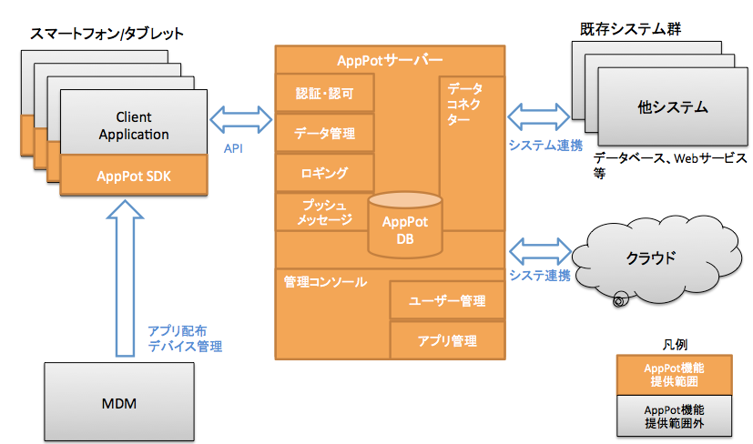
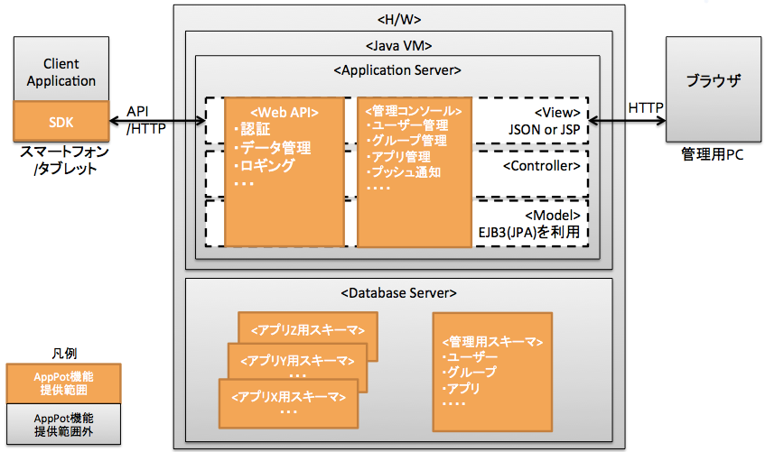
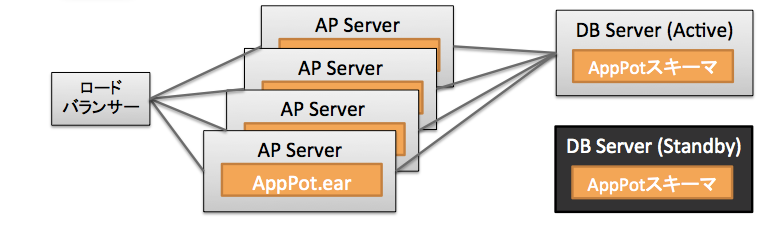

# AppPotのシステムアーキテクチャー

# 単純な環境構築

- AppPotはJava EEとDBからなる
 1. アプリケーションはAPサーバーにearファイルとしてデプロイされる
 2. 管理用スキーマがDBに作成される
 3. AppPotによってモバイルアプリ作成時に、モバイル用スキーマが自動的に作成される
 
- APサーバー
AppPotはEJBを実装したAPサーバーが必要
	- WebLogic Server
	- JBoss AS
	- WebSphere Application Server

- DB
	- Oracle Database
	- MySQL
	- SQL Server

- OS
	- 対応するAPサーバー、DBをサポートするOSを使用可能

# 前提となるソフトウェア
## OS
- CentOS 6
- APサーバー
	- JBoss 7.1.1

- DB
	- MySQL 5.6.14

## 環境構築(手作業)
- DBの設定

- APの設定

## 環境構築(Chef)
事前にsshでリポジトリにアクセスできるように設定した上で、
以下のコマンドを実行する

    curl -L https://raw.github.com/karuru6225/chef-repo/master/scripts/setup.sh |bash
    git clone git@github.com:ncdc-dev/chef-repo-apppot.git
    cd chef-repo-apppot
    ./scripts/prepare.sh
    ./scripts/run_chef-solo.sh config/jboss.json

sshの設定例

    mkdir .ssh
    chmod 700 .ssh
    echo "host github.com
    user git
    hostname github.com
    identityfile ~/.ssh/private_key
    " > .ssh/config
    touch private_key
    chmod 600 .ssh/*

### JBoss
- セットアップ先ディレクトリ
	- /usr/share/jboss-as-7.1.1.Final
- ログ出力先
	- /var/log/jboss-as/console.log
- 設定ファイル
	- /etc/jboss-as/jboss-as.conf
	- /usr/share/jboss-as-7.1.1.Final/standalone/configuration/standalone.xml

### AppPotのインストール
ミドルウェアのインストールが終わると、次はAppPotのインストールです。AppPotのインストールは大きく分けるとデータベースの作成と、アプリケーションのデプロイに分けられます。

AppPotデータベースの作成
事前にAppPot用のデータベースユーザーを作成してください。必要な権限は次の通りです。

* 
* 

次にAppPot用のデータベースユーザーを利用して、次のスクリプトを実行します。

`TODO`

AppPotのインストールは次のコマンドラインで行うことができます。

`ant deploy {apppot.warのパス} {対象のコンテキストルート}`

例 
`ant deploy ./apppot.war apppot`

コンテキストルートは同一のサーバーで一意になる必要があります。
異なるコンテキストルートを使用することで、複数のAppPot環境を同一サーバーで稼働させることができます。これは開発時に開発用、テスト用など複数の環境を用意したい時に便利です。

## 高可用構成

- AP
	- APサーバーは複数台でActive-Active構成をとることで、高性能、高可用性を実現できる。
	- AP側には状態を保存しないため、障害が発生した場合でも他のサーバーが処理を引き継ぐことができる

- DB
	- DB製品の高可用性構成をとる。
