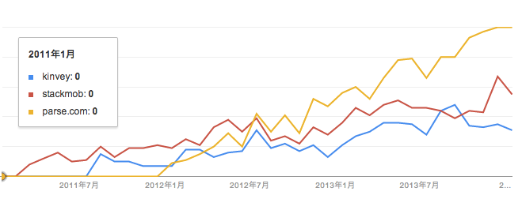

## BaaSとは？
近年、スマートフォンやタブレットといった、スマートデバイスが普及しています。モバイルアプリケーション開発には、フロントエンド側（スマートデバイスで動作するアプリケーション）とバックエンド側（サーバー側で動作するアプリケーション、ミドルウェア等）の開発が必要です。  
一般的には、BaaS（Backend as  a Service）とは、モバイルアプリケーションの開発でバックエンド側に必要とされる機能を提供するサービスです。
BaaSを使うことで、バックエンドの開発が大幅に軽減されます。

## BaaSが提供するサービス
具体的には以下のような機能が提供されています

 - 認証機能
 - Push通信
 - データの保存、共有機能
 - etc...

## BaaS　サービス一覧
2014年2月現在、主だったBaaS製品は以下のようなものがあります。

### 海外製品
- Parse
	-  日本語のドキュメントがない
	-  iOS、OS X、Android、Javascript、.NETのSDKがある
	-  Basic、Proの2種類の料金プラン＋Enterprise

- Kinvey
	-  日本語のドキュメントがある
	-  iOS、Android、Java、HTML5、その他多種多様SDKがある
	-  独自のData Link技術によって企業のオンプレミスまたはクラウドのデータストレージと接続できる
	-  料金形態が不明瞭

- StackMob
	- iOS、Android、JavascriptのSDKがある
	- 基本無料。機能ごとに購入する形をとる

上記サービスのGoogle Trendsで検索すると以下のようになります。

### 国内製品
- appiaries
	- 日本語のドキュメントが充実している
	- SDKがない、APIのみ
	- 無料、Ultra Lite、Basicの3種類の料金プラン＋Enterprise

- AppPot
	- iOS、Android、JavascriptのSDKがある
	- Enterpriseのみ

## MEAPとは？
MEAP（Mobile Enterprise Application Platform）とはモバイルアプリケーション向けのプラットフォームで、複数のプラットフォームでのモバイルアプリケーションを統一された環境で開発できるようになります。
また、既存のバックエンドのシステムと簡単に接続できるような仕組みを備えています。

調査会社のガートナーによると、以下の特徴を持っているものをMEAPと定義しています。

1. 3つ以上のモバイルアプリケーションをサポート
2. 3つ以上のモバイル·オペレーティング·システム（OS）をサポート
3. 少なくとも3つのバックエンドデータソースと統合

## MDMとは？
MDM（Mobile Device Management）とはスマートデバイスを管理するためのシステムです。スマートデバイスは高機能で、持ち歩けるという利点を持つ反面、紛失や盗難など情報漏洩などの危険が伴います。MDMを使用することで、端末の状態や、使用状況などを把握でき、リモートで、端末の情報を削除（リモートワイプ）したり、端末をロックし使用できなくすることができます。
また、端末からアクセスできる情報の制限や、使用できる端末の機能の制限をすることでき、情報漏洩につながる機能を予め使えなくしておくこともできます。
